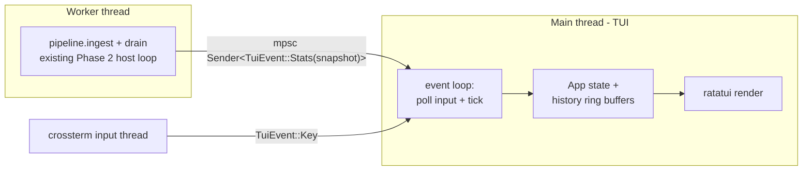

I'll analyze the Idea.md thoroughly and research how Yocto fits in, then build you an ordered plan. Let me gather some current, authoritative context first.  


Fetched 2 resources

Fetched 2 resources

I've read the file closely and pulled current facts on the two pieces that matter most for your "expert" goal: **Yocto+Rust integration** (via `meta-rust` / `cargo-bitbake`) and the **embedded-hal v1.0** ecosystem. Here's my analysis before I lock the plan.

## What Idea.md actually proposes

It's a well-argued pitch for one portfolio project: a **Fault-Tolerant Telemetry Logger** firmware in Rust.

- **Core pipeline:** `Input → Framer → Validator → Filter → Queue/Buffer → Storage Writer → Health/Stats`. Each stage has one job (reconstruct packets, check CRC/length/sequence, allow/block by class, absorb bursts, persist safely, count drops/failures).
- **Two-layer architecture:** a host-testable **pure-logic crate** (`no_std`, no heap, fixed buffers via `heapless`) plus a **hardware crate** that wires up UART/SPI/SD. The whole point is that the interesting logic runs and is tested on your laptop; only transport/peripherals are hardware-specific.
- **Trait-based portability** (`PacketSource`, `Storage`) so the same core runs against File/TCP on host and UART/SPI on a board — this mirrors why `embedded-hal` exists.
- **The "expert" signals it targets:** `no_std`/heap-free design, ownership as a hardware resource-arbitration story, minimal well-justified `unsafe` behind safe wrappers, host tests + fuzz-like malformed input, and CI with `fmt`/`clippy`/tests.
- **Roadmap built in:** v1 blocking → v2 async (Embassy). It explicitly says you can build ~90% of it with **zero hardware** using simulated input/storage, then add a real board later.

## What my research confirms / updates

- **embedded-hal is at v1.0 (stable since Jan 2024).** UART is now done via **`embedded-io`**, not embedded-hal serial traits. SPI bus-sharing uses `SpiDevice` + **`embedded-hal-bus`**. Async is real on stable Rust via **`embedded-hal-async`** (and Embassy). So the file's advice is current, with these crate-name corrections.
- **Yocto + Rust is mature.** `meta-rust` provides the toolchain and, critically, **`cargo-bitbake`** auto-generates a BitBake recipe from your `Cargo.toml` (fetching pegged crate versions for reproducible builds). Modern Yocto also has Rust support in core.

## The one big fork in the road

Here's the key tension you should decide on: **Yocto builds embedded *Linux* images** — that means `std` Rust running as a userspace daemon/systemd service on a SoC (e.g. Raspberry Pi / i.MX). That is the **opposite** of the `no_std` bare-metal MCU path the file emphasizes. Both are impressive, but they're different deployment models.

The genuinely *expert-level* move is to exploit your existing trait-based core so it powers **three backends from one codebase**: host simulation, bare-metal MCU (`no_std`), and **embedded Linux via Yocto** (`std` + systemd + real `/dev/ttyS*` + filesystem). That makes Yocto a natural third target rather than a bolt-on.

Let me confirm a few decisions so the plan is exact: 

Analyzing your answers...

Good — all three backends, real hardware, full Yocto image. Let me explain the concurrency choice you asked about, then settle two last details.

## Blocking vs Async (Embassy) — comparison

**Blocking (v1)** — the CPU waits at each I/O call until it completes.

- *How it looks:* a `loop` that calls `uart.read()` (blocks), parses, `sd.write()` (blocks). Concurrency, if any, comes from interrupts pushing bytes into a ring buffer that the main loop drains.
- *Pros:* Simplest mental model; easiest to debug; works with plain `embedded-hal` v1.0 blocking traits; smallest dependency surface; matches how a lot of real firmware is still written. Fastest path to "it works."
- *Cons:* Doing two things "at once" (ingest while writing to SD) is awkward — you lean on ISRs + shared buffers, and you hand-roll the coordination. Under bursty input, a long SD write can stall ingestion unless you carefully structure ISRs.
- *Best when:* You want a clean, explainable, low-risk first version and a clear story about ownership/`Send`/`Sync` around shared buffers.

**Async (Embassy, v2)** — I/O calls yield instead of blocking; an executor runs other tasks meanwhile.

- *How it looks:* one `async` task for ingestion, another for the storage writer, communicating through an async channel. `uart.read().await` lets the writer task run while waiting for bytes.
- *Pros:* Natural concurrency without an RTOS or manual ISR plumbing; backpressure via channels is elegant; no heap/dynamic dispatch (works on stable since Rust 1.75); Embassy gives you timers, executors, and async HALs for RP2040/STM32/nRF. This is the "modern Rust" signal recruiters notice.
- *Cons:* Steeper concepts (futures, executors, `Pin` occasionally leaks through); harder to debug; bigger dependency stack; more moving parts to explain.
- *Best when:* You want to demonstrate advanced, current embedded-Rust competence and have multiple concurrent activities.

**My recommendation: do both, in order (v1 blocking → v2 async).** This isn't busywork — it gives you an *evolution narrative* that's genuinely impressive: "I built it blocking, profiled the burst-handling limitation, then re-architected to async tasks with channel backpressure." That story demonstrates more engineering judgment than either version alone, and the portable core crate stays unchanged across both — proving your architecture was right.

One last clarification on hardware, then I'll write the full plan:  

Analyzing your answers...

All decisions captured. Writing the plan now. 

Created memory file [](file:///c%3A/Users/z00541ce/AppData/Roaming/Code/User/workspaceStorage/704d0b0532f375c9a6c94c42c2d1e9dd/GitHub.copilot-chat/memory-tool/memories/NGQxZjc3ZDMtZmFkMS00NzA1LWE5ODQtMmVjMmZjOTU5NzMy/plan.md)

Here's the full plan.

## Plan: Rust Telemetry Logger — portable core, 3 backends + Yocto

Build a **Fault-Tolerant Telemetry Logger** where one `no_std` core crate (parse → validate → filter → buffer → persist → stats) drives **three deployment targets** from the same code: host simulation, embedded Linux via Yocto (systemd daemon on a Pi-class SoC), and bare-metal RP2040 firmware (blocking v1 → async/Embassy v2). The "one portable core, three backends" design is exactly the expert signal you want.

**Architecture (Cargo workspace)**
```
crates/telemetry-core   no_std logic: framer, CRC validator, filter, ring buffer, record format, stats, traits
crates/telemetry-host   std: File/TCP/UDP source + rotating file storage (simulation)
crates/telemetry-linux  std: serialport source + fs storage + systemd-ready daemon → Yocto target
crates/telemetry-fw     no_std RP2040 firmware (v1 blocking, v2 async)
tools/packet-generator  std: emits valid/invalid/bursty frames
yocto/meta-telemetry    BitBake layer: recipe + systemd .service + image .bbappend
```

**Steps (phased)**

1. **Phase 0 — Foundations.** git + workspace `Cargo.toml`, `rustfmt.toml`, `clippy.toml`, CI skeleton, README problem statement, and `docs/protocol.md` (frame = preamble/len/type/severity/seq/payload/CRC).
2. **Phase 1 — `telemetry-core` (no_std) + tests** *(the heart)*. Error enum, `Stats`, traits (`PacketSource`/`Storage`/`Clock`), framer with resync, CRC+length+sequence validator, type/severity filter, `heapless` ring buffer with high-water mark, record formatter. Heavy unit tests for corrupt/truncated/oversized/garbage-resync/overflow; optional `cargo-fuzz`. *Depends on Phase 0.*
3. **Phase 2 — Host simulation (std).** `packet-generator` tool + `telemetry-host` (File/TCP/UDP source, rotating file storage, metrics). Integration + rotation-policy tests. *Depends on Phase 1.*
4. **Phase 3 — Embedded Linux daemon (std)** *(bridge to Yocto)*. `telemetry-linux`: `serialport` source, fs storage with rotation, TOML config, graceful shutdown, `sd-notify` readiness. Testable with **no board** via `socat` virtual serial pair fed by the generator. *Depends on Phases 1–2.*
5. **Phase 4 — Yocto integration** *(differentiator)*. poky + meta-openembedded + meta-rust (+ meta-raspberrypi); `cargo-bitbake` generates the recipe; `meta-telemetry` layer adds the systemd unit + image append; build a custom image that auto-starts the logger and **boot it in QEMU (qemuarm64)** before real hardware. *Depends on Phase 3.*
6. **Phase 5 — RP2040 firmware v1 (blocking).** `rp-hal`, `embedded-io` UART (interrupt → ring buffer), `embedded-sdmmc` over SPI via `embedded-hal-bus`, `defmt`/RTT metrics. **Reuses `telemetry-core` unchanged.** *Depends on Phase 1; parallel with Phase 4.*
7. **Phase 6 — RP2040 firmware v2 (async/Embassy).** `embassy-rp` + executor, ingestion + storage tasks linked by an `embassy-sync` channel (backpressure), `embedded-hal-async`, shared SPI bus, watchdog + partial-write recovery + fault injection. Core crate **still unchanged** → proves the architecture. *Depends on Phase 5.*
8. **Phase 7 — Expert polish.** README with mermaid diagram, why-Rust, **safety story + `unsafe` inventory**, memory-model/failure-modes/bring-up docs, CI matrix (host tests, clippy, fmt, `thumbv6m` no_std build, `aarch64` cross-build), feature flags (`sdcard`, `async`, `metrics`, `simulator`).

**Relevant files**
- Idea.md — source pitch; keep as design rationale, refine into README.
- `crates/telemetry-core/src/lib.rs` — `#![no_std]`; framer/validator/filter/ringbuf + `PacketSource`/`Storage`/`Clock` traits (the reuse contract across all three backends).
- `crates/telemetry-linux/src/main.rs` — the binary Yocto packages; `cargo-bitbake` reads its `Cargo.toml`.
- `yocto/meta-telemetry/recipes-telemetry/...` — recipe, `telemetry-logger.service`, image `.bbappend`.
- `crates/telemetry-fw/src/main.rs` — RP2040; v1 blocking then v2 async, importing `telemetry-core` unmodified.

**Verification**
1. `cargo test -p telemetry-core` + `cargo build -p telemetry-core --target thumbv6m-none-eabi` (proves logic + no_std).
2. Host: `packet-generator | telemetry-host` end-to-end; rotation + stats asserted in integration tests.
3. Linux daemon: `socat` pty pair + generator + `telemetry-linux`; logs written, clean `SIGTERM`.
4. Yocto: image boots in QEMU; `systemctl status telemetry-logger` active; data fed in produces logs on rootfs.
5. Firmware: flash Pico via probe-rs; generator over USB-serial; RTT counts + files on SD; v2 sustains bursts without ingest stall and recovers via watchdog.
6. CI green: fmt, clippy (deny warnings), host tests, no_std + aarch64 cross builds.

**Decisions**
- All three backends; RP2040 for bare-metal; **Linux SoC: recommend Raspberry Pi 4/5, validated in QEMU first** (your one open hardware choice).
- v1 blocking → v2 async is deliberate: it yields an *evolution narrative* (built blocking, found the burst-stall limit, re-architected to async channels) that demonstrates engineering judgment.
- **Out of scope initially:** wireless/BLE, OTA, web dashboard, multi-board HAL — listed as "planned" in README.

**Further considerations**
1. **Linux SoC pick** — *Recommend Pi 4/5* (best Yocto/`meta-raspberrypi` support). Option A: Pi 4/5 / Option B: NXP i.MX8 (more "industry," steeper) / Option C: QEMU-only for now.
2. **Serialization format** — *Recommend `postcard`* (no_std-friendly, compact) for storage records, with optional JSON on host for readability. Option A: postcard / Option B: raw binary / Option C: CBOR.
3. **Yocto in CI** — *Recommend documenting the build manually* (full BitBake builds are too heavy/slow for GitHub Actions) and keeping CI focused on Rust. Option A: docs-only / Option B: self-hosted runner / Option C: cache-heavy GH Actions build.

Want me to adjust scope or ordering, or settle the three "further considerations" above? Once you approve, you can hand this off for implementation.


I'll explain each consideration in depth so you can make informed calls.

---

## Consideration 1 — Which Linux SoC for the Yocto backend

This choice determines how hard the Yocto bring-up is, how "industry-credible" the project reads, and how much you can do without spending money. Yocto builds an entire embedded **Linux** image (kernel + rootfs + your daemon), so the board's BSP (Board Support Package) layer quality matters enormously — a good BSP means a working image in hours, a bad one means days of debugging device trees and bootloaders.

### Option A — Raspberry Pi 4 / 5 *(recommended)*

**What it is:** A Broadcom-based SBC with the `meta-raspberrypi` Yocto BSP layer, which is one of the best-maintained community BSPs in existence.

**Why it's the strong default:**
- `meta-raspberrypi` is actively maintained and tracks current Yocto releases (scarthgap, kirkstone). You get a bootable image with `MACHINE = "raspberrypi4-64"` and almost no fuss — the layer handles the bootloader, kernel, and device tree for you.
- Massive community + documentation. Nearly every Yocto tutorial uses a Pi, so when you hit an error, someone has already solved it.
- Real hardware is cheap and you likely have access to one. UART pins (GPIO 14/15) and USB-serial adapters make feeding telemetry trivial.
- You can prototype the **entire image in QEMU** (`qemuarm64`) first, then flash the identical recipe/layer to the real Pi by just changing `MACHINE`. That de-risks everything.

**Trade-offs:**
- Broadcom SoCs are seen as "hobbyist/consumer" rather than "industrial." A recruiter in deep industrial embedded *might* note it's not an i.MX or TI part. But for demonstrating Yocto+Rust competence, this is a minor cosmetic point — the skills transfer 1:1.
- The Pi's closed-source boot blob is philosophically less "pure embedded," though irrelevant to your project's value.

**Best when:** You want the highest probability of a working, demonstrable image with the least time lost to BSP debugging — which is exactly the right priority for a portfolio piece.

### Option B — NXP i.MX (e.g. i.MX8)

**What it is:** An industrial-grade ARM SoC family from NXP, supported by the `meta-freescale` / `meta-imx` BSP layers. This is what real products (automotive HMIs, industrial gateways, medical devices) frequently ship on.

**Why you'd pick it:**
- **Maximum industry credibility.** "I built a Yocto image for an i.MX8" reads as production-grade embedded Linux experience. This is the SoC family many embedded-Linux job postings explicitly name.
- `meta-freescale` is professionally maintained (NXP contributes directly). The BSP supports advanced features — secure boot, multiple cores, hardware crypto — that you could later showcase.
- It aligns with the "fault-tolerant telemetry/ECU" framing in your Idea.md; i.MX parts genuinely appear in automotive/industrial telemetry gateways.

**Trade-offs:**
- **Steeper bring-up.** i.MX BSPs are more complex — you deal with U-Boot configuration, sometimes NXP EULA-gated firmware blobs, and more intricate device trees. More ways to get stuck.
- **Cost.** An i.MX8 dev board (e.g. a Variscite or Boundary Devices SoM, or the i.MX8M EVK) is significantly more expensive than a Pi.
- QEMU emulation exists but is less turnkey than `qemuarm64` for a Pi-equivalent workflow, so the "validate before buying" path is rougher.

**Best when:** You're specifically targeting industrial/automotive embedded-Linux roles and are willing to absorb the extra complexity and cost for the credibility payoff.

### Option C — QEMU-only for now (`qemuarm64`)

**What it is:** Don't pick physical hardware yet. Build and boot the entire Yocto image under QEMU using the generic `qemuarm64` machine that comes with poky itself.

**Why you'd pick it:**
- **Zero cost, fastest start.** poky ships `qemuarm64` out of the box; `runqemu` boots your image in a window. You can build, boot, and demonstrate the systemd service + log-writing with no hardware at all.
- Decouples the "prove Yocto+Rust works" milestone from any hardware purchase decision. You learn the entire Yocto workflow (layers, recipes, `cargo-bitbake`, image customization) first.
- The recipe and `meta-telemetry` layer you write are **machine-agnostic** — moving to a real Pi or i.MX later is mostly a `MACHINE` change plus adding the BSP layer.

**Trade-offs:**
- No real serial hardware, so telemetry ingestion in the image is via a virtual/emulated interface (QEMU can expose a host serial/socket to the guest) rather than physical UART pins. Slightly less "real."
- A purely emulated demo is marginally less impressive than "it boots on this board on my desk" — though your README can note hardware is a `MACHINE`-swap away.

**Best when:** You want to validate the whole pipeline immediately and defer (or avoid) hardware spend. This is the natural *starting point* regardless of final choice.

**My synthesis:** Start with **C (QEMU)** for development, target **A (Pi 4/5)** as the real hardware. Mention **B (i.MX)** in the README's "planned targets" — that line alone signals you understand the industrial landscape without requiring you to buy the expensive board.

---

## Consideration 2 — Storage record serialization format

When a valid frame passes the filter, you serialize it (plus metadata: timestamp, sequence number, source tag) into bytes for the log. The format affects `no_std` compatibility, log size, write throughput, and how easy logs are to inspect. Because the **same `telemetry-core` crate runs on the MCU and on Linux**, the format must work in `no_std` without heap allocation.

### Option A — `postcard` *(recommended)*

**What it is:** A `#![no_std]`, allocation-free binary serialization format built on `serde`, designed specifically for embedded Rust. You `#[derive(Serialize, Deserialize)]` on your record struct and `postcard` produces a compact byte stream.

**Why it's the strong default:**
- **Purpose-built for your exact constraints.** It works in `no_std`, serializes into a fixed `&mut [u8]` slice (no heap), and is the de-facto standard for embedded Rust telemetry/logging. Using it signals you know the ecosystem.
- **Compact.** It uses varint encoding, so small integers take few bytes — important when writing to a size-limited SD card or flash and when you care about write throughput/wear.
- **Symmetric.** The same derive works on host, Linux, and MCU. Your `packet-generator` and any replay/decoder tool can deserialize with the identical types — strong type-safety story end to end.
- Pairs naturally with `heapless` and `serde`, which you're already using.

**Trade-offs:**
- Binary, so not human-readable — you need a small decoder tool (which is itself a nice portfolio detail) or you emit JSON only on the host side for eyeballing.
- Schema evolution is your responsibility: if you add a field, old logs need versioning. Easily handled with a format-version byte in the record header.

**Best when:** You want the embedded-correct, ecosystem-standard choice that works uniformly across all three backends. This is the right answer for this project.

### Option B — Raw hand-rolled binary

**What it is:** You manually write each field to the byte buffer with explicit offsets and endianness — no serialization library, just `buf[0..4].copy_from_slice(&timestamp.to_le_bytes())` style code.

**Why you'd pick it:**
- **Maximum control and zero dependencies.** You know exactly how many bytes each record is, byte-for-byte. Great for documenting *worst-case memory usage* — a point your Idea.md explicitly wants to highlight.
- **Pedagogically honest to embedded work.** Real low-level firmware often does exactly this. It demonstrates you understand wire formats, endianness, and alignment without hiding behind a library.
- Trivially `no_std`, no allocation, fully deterministic size.

**Trade-offs:**
- **More error-prone and more boilerplate.** Manual offset math is a classic bug source (off-by-one, endianness mismatches), and you re-implement encode *and* decode by hand.
- Schema changes mean editing offset arithmetic in multiple places.
- Reads as "reinventing the wheel" unless you frame it deliberately as a memory-determinism choice.

**Best when:** You want to showcase raw wire-format mastery and absolute size determinism, and you're willing to write/verify the byte-twiddling carefully. A good fit if the *protocol-level* skill is the thing you most want to display.

### Option C — CBOR (e.g. `minicbor` or `ciborium`)

**What it is:** A standardized, self-describing binary format (RFC 8949) — think "binary JSON." `minicbor` is a `no_std`-friendly Rust implementation.

**Why you'd pick it:**
- **Self-describing + standardized.** Unlike `postcard`, CBOR carries enough structure to be decoded by *any* CBOR tool in any language — useful if you imagine logs being consumed by an external analytics system. That's a realistic "telemetry pipeline" story.
- More schema-evolution friendly than raw binary, and human-decodable via standard `cbor2diag`-style tools.
- `minicbor` supports `no_std`.

**Trade-offs:**
- **Larger than `postcard`** because of the self-describing field tags — more bytes per record, which matters on constrained storage.
- Slightly more ceremony than `postcard` for a project where you control both encoder and decoder (so the self-describing benefit is partly wasted).
- Less idiomatic in the embedded-Rust telemetry niche than `postcard`.

**Best when:** You want to tell an interoperability story ("logs flow into a standard CBOR-consuming backend") and can spare the extra bytes. Overkill if you own both ends.

**My synthesis:** **A (`postcard`)** for the actual records — it's the embedded-Rust-correct answer and works identically across all backends. Consider adding a **human-readable JSON output mode on the host backend only** (gated behind a feature flag), giving you the best of both: compact binary on-device, readable logs when simulating. You could even document **B (raw binary)** reasoning in `docs/memory-model.md` to show you considered the determinism trade-off.

---

## Consideration 3 — Should Yocto builds run in CI

CI (GitHub Actions) is where you prove the project stays green. The question is whether the heavyweight Yocto image build belongs there alongside your fast Rust checks.

### Option A — Document the Yocto build manually, keep CI Rust-only *(recommended)*

**What it is:** CI runs `cargo fmt`, `cargo clippy`, host tests, the `no_std` `thumbv6m` build, and the `aarch64` cross-compile. The Yocto image build lives in `docs/` as reproducible step-by-step instructions, run on your own machine.

**Why it's the strong default:**
- **A full BitBake build is enormous** — it compiles a toolchain, kernel, and hundreds of packages, often taking **hours** and tens of GB of disk on a first build. GitHub's free hosted runners (limited cores, ~14 GB disk, time limits) are a poor fit and builds frequently fail on resource exhaustion.
- Your *Rust* correctness — the thing that actually changes commit-to-commit — is fully covered by the fast checks. The Yocto layer changes rarely.
- Clean separation: fast feedback on code, documented reproducibility on the image. Recruiters can read `docs/yocto.md` and see you know the workflow without CI needing to run it.

**Trade-offs:**
- The Yocto build isn't *automatically* verified on every commit, so a recipe could silently rot. Mitigated by pinning Yocto release branches and crate versions (`cargo-bitbake` pegs crates), which keeps it reproducible.

**Best when:** Almost always, for a portfolio project. Fast CI + documented image build is the pragmatic professional norm.

### Option B — Self-hosted runner for Yocto

**What it is:** You register your own machine (or a cloud VM) as a GitHub Actions self-hosted runner, with `sstate-cache` and `downloads` persisted between runs so rebuilds are incremental.

**Why you'd pick it:**
- **Genuinely impressive CI/CD story.** "My pipeline builds the full embedded Linux image on every release tag" is a strong DevOps-for-embedded signal — few portfolio projects do this.
- With a warm `sstate-cache`, incremental builds drop from hours to minutes, making it actually practical.
- You control the resources (disk, cores), eliminating the hosted-runner limitations.

**Trade-offs:**
- **Operational burden.** You maintain the runner, its security (self-hosted runners on public repos are a known security risk — a malicious PR can run code on your machine), and its disk/cache hygiene.
- Cost/availability: the machine must be online for CI to work; cloud VMs cost money.
- Overkill unless the CI/CD-for-embedded story is itself a thing you want to sell.

**Best when:** You're targeting roles where build-infrastructure-for-embedded is a core competency and you're comfortable running and securing the infrastructure.

### Option C — Cache-heavy GitHub-hosted Actions build

**What it is:** Attempt the Yocto build on standard hosted runners, leaning hard on `actions/cache` for `sstate-cache` and `downloads`, plus disk-cleanup steps to reclaim space.

**Why you'd pick it:**
- No self-hosted infrastructure to maintain — stays fully on GitHub.
- A warm cache *can* bring builds into a tolerable window, and it demonstrates you understand Yocto's `sstate` acceleration mechanism.

**Trade-offs:**
- **Fragile.** GitHub's cache has size limits (~10 GB per repo) that `sstate-cache` + `downloads` blow past quickly, causing cache eviction and cold rebuilds. Disk-space exhaustion on hosted runners is a constant battle.
- Cold builds (cache miss) will likely **time out** or fail. You'll spend real effort fighting the runner rather than building features.
- Flaky CI on a portfolio repo looks *worse* than no Yocto CI at all — a red X on the badge undermines the impression.

**Best when:** Rarely advisable. Only if you specifically want to demonstrate fighting Yocto into constrained CI, and you accept the flakiness risk.

**My synthesis:** **A (document, Rust-only CI)** is correct for almost everyone — it keeps CI fast and green while the pinned recipe + `docs/yocto.md` prove reproducibility. Treat **B (self-hosted)** as a *stretch goal* you mention in the README roadmap ("planned: self-hosted runner builds the image on release tags") — that line signals the ambition without the maintenance cost. Avoid **C** unless you enjoy pain.

---

### Where this leaves the plan

My recommended settings: **QEMU-first → Pi 4/5** (mention i.MX as planned), **`postcard`** records with an optional host-only JSON mode, and **Rust-only CI** with the Yocto build documented. If you agree, I'll lock these into the plan; tell me any you'd like to change and I'll update it.


Good catch — this is worth expanding because it's a small piece of work with an outsized payoff for the project's story.

## The problem it solves

Once you choose `postcard` (or any binary format), your logs on disk/SD are **compact binary blobs**, not text. If you `cat telemetry.log` you get garbage bytes. So you need something that turns those bytes back into readable records:

```
[binary log file] → decoder tool → human-readable output (table / JSON / NDJSON)
```

That "something" is the **decoder tool** — a small `std` binary in your workspace (e.g. `tools/telemetry-decode/`) that reads a binary log file and deserializes each record back into your `LogRecord` struct using the exact same type from `telemetry-core`.

## Why it's more than a convenience

The key insight: the decoder **imports `telemetry-core` and reuses the identical `LogRecord` type** the firmware used to *write* the log. That single fact demonstrates several things at once:

- **Symmetric serialization with one source of truth.** Encoder (on MCU, `no_std`) and decoder (on host, `std`) share the same struct definition. There's no second, hand-maintained schema that can drift out of sync. This is exactly the type-safety guarantee `postcard` + `serde` give you, and showing it end-to-end is a strong signal.
- **Cross-environment code reuse, proven.** It's concrete evidence that your `no_std` core really is portable — the same crate that runs on a Pico also powers a desktop CLI. That's the architectural claim your whole project makes; the decoder *proves* it in miniature.
- **Closes the pipeline.** Your Idea.md framing is "parse → validate → filter → persist → recover." The decoder is the "read it back" bookend that makes the system feel complete and real, not write-only.

## What it actually does (scope is small)

A first version is maybe 60–120 lines:

1. Open the binary log file (or read stdin).
2. Loop: read a length-prefixed record, `postcard::from_bytes::<LogRecord>(&buf)`.
3. Print each record — default as an aligned text table, with flags for other formats.
4. Handle a truncated/corrupt trailing record gracefully (report it, don't panic) — which ties into your fault-tolerance theme.

Useful flags that make it look polished without much effort:
- `--format table|json|ndjson` — NDJSON (one JSON object per line) is the format log-analysis tools and `jq` expect, so this is a realistic "feeds into an analytics pipeline" detail.
- `--filter type=ERROR` or `--since <seq>` — reuse your `telemetry-core` filter logic here too, demonstrating *more* code reuse.
- `--stats` — replay the file and print aggregate counts (total records, per-type, CRC failures recorded), reusing your `Stats` struct.

## Why it reads well to a reviewer

It shows **systems thinking**: you didn't just produce data, you built the tooling to consume and inspect it — which is what engineers on real telemetry/observability teams actually do. It's a low-risk, high-clarity addition: easy to write, easy to demo (`telemetry-decode logs/run1.bin --format table`), and it visibly reinforces the project's central architecture claim (portable core, one schema, three+ environments).

## How it fits the plan

It slots into **Phase 2 (Host simulation)** as a natural companion to `packet-generator`:
- `packet-generator` creates frames going *in*.
- `telemetry-decode` reads records coming *out*.

Together they give you a fully closed, hardware-free loop you can run and demo on day one: generate → ingest → filter → persist → **decode and inspect**. It also becomes a debugging aid for the later Linux and firmware phases — when the Pico writes to an SD card, you pull the file and decode it on your laptop with the same tool.

Want me to add `tools/telemetry-decode/` explicitly to the plan (Phase 2 deliverable, with the `--format`/`--filter`/`--stats` flags and shared `LogRecord`/`Stats` reuse noted)?


I'll update the plan with these three decisions. 

Updated memory file [](file:///c%3A/Users/z00541ce/AppData/Roaming/Code/User/workspaceStorage/704d0b0532f375c9a6c94c42c2d1e9dd/GitHub.copilot-chat/memory-tool/memories/NGQxZjc3ZDMtZmFkMS00NzA1LWE5ODQtMmVjMmZjOTU5NzMy/plan.md)

Now let me update the layout, the relevant phases, and the scope section. 

Updated memory file [](file:///c%3A/Users/z00541ce/AppData/Roaming/Code/User/workspaceStorage/704d0b0532f375c9a6c94c42c2d1e9dd/GitHub.copilot-chat/memory-tool/memories/NGQxZjc3ZDMtZmFkMS00NzA1LWE5ODQtMmVjMmZjOTU5NzMy/plan.md)

Updated memory file [](file:///c%3A/Users/z00541ce/AppData/Roaming/Code/User/workspaceStorage/704d0b0532f375c9a6c94c42c2d1e9dd/GitHub.copilot-chat/memory-tool/memories/NGQxZjc3ZDMtZmFkMS00NzA1LWE5ODQtMmVjMmZjOTU5NzMy/plan.md)

Updated memory file [](file:///c%3A/Users/z00541ce/AppData/Roaming/Code/User/workspaceStorage/704d0b0532f375c9a6c94c42c2d1e9dd/GitHub.copilot-chat/memory-tool/memories/NGQxZjc3ZDMtZmFkMS00NzA1LWE5ODQtMmVjMmZjOTU5NzMy/plan.md)

Updated memory file [](file:///c%3A/Users/z00541ce/AppData/Roaming/Code/User/workspaceStorage/704d0b0532f375c9a6c94c42c2d1e9dd/GitHub.copilot-chat/memory-tool/memories/NGQxZjc3ZDMtZmFkMS00NzA1LWE5ODQtMmVjMmZjOTU5NzMy/plan.md)

Now the Yocto phase and the CI/scope sections. Let me view those parts. 

Read memory [](file:///c%3A/Users/z00541ce/AppData/Roaming/Code/User/workspaceStorage/704d0b0532f375c9a6c94c42c2d1e9dd/GitHub.copilot-chat/memory-tool/memories/NGQxZjc3ZDMtZmFkMS00NzA1LWE5ODQtMmVjMmZjOTU5NzMy/plan.md)

Read memory [](file:///c%3A/Users/z00541ce/AppData/Roaming/Code/User/workspaceStorage/704d0b0532f375c9a6c94c42c2d1e9dd/GitHub.copilot-chat/memory-tool/memories/NGQxZjc3ZDMtZmFkMS00NzA1LWE5ODQtMmVjMmZjOTU5NzMy/plan.md)

Updated memory file [](file:///c%3A/Users/z00541ce/AppData/Roaming/Code/User/workspaceStorage/704d0b0532f375c9a6c94c42c2d1e9dd/GitHub.copilot-chat/memory-tool/memories/NGQxZjc3ZDMtZmFkMS00NzA1LWE5ODQtMmVjMmZjOTU5NzMy/plan.md)

Updated memory file [](file:///c%3A/Users/z00541ce/AppData/Roaming/Code/User/workspaceStorage/704d0b0532f375c9a6c94c42c2d1e9dd/GitHub.copilot-chat/memory-tool/memories/NGQxZjc3ZDMtZmFkMS00NzA1LWE5ODQtMmVjMmZjOTU5NzMy/plan.md)

Plan updated with all three decisions locked. Here's the refreshed plan.

## Plan: Rust Telemetry Logger — portable core, 3 backends + Yocto

One `no_std` core crate (parse → validate → filter → buffer → persist → stats) drives **three backends**: host simulation, embedded Linux via Yocto (Pi 4/5, QEMU-first), and bare-metal RP2040 firmware (blocking v1 → async v2). Records are `postcard`-encoded with a version byte; a host decoder tool reads them back.

**Architecture (Cargo workspace)**
```
crates/telemetry-core    no_std logic + traits (PacketSource/Storage/Clock) — shared by all targets
crates/telemetry-host    std: File/TCP/UDP source + rotating file storage (simulation)
crates/telemetry-linux   std: serialport source + fs storage + systemd-ready daemon → Yocto
crates/telemetry-fw      no_std RP2040 firmware (v1 blocking, v2 async)
tools/packet-generator   std: emits valid/invalid/bursty frames
tools/telemetry-decode   std: binary postcard log → table/json/ndjson (reuses LogRecord/Stats)
yocto/meta-telemetry     BitBake layer: recipe + systemd .service + image .bbappend
```

**Steps (phased)**

1. **Phase 0 — Foundations.** Workspace + `rustfmt`/`clippy` config, CI skeleton, README, and `docs/protocol.md` defining the frame layout and the **`postcard` `LogRecord` with a leading format-version byte** for schema evolution.
2. **Phase 1 — `telemetry-core` (no_std) + tests** *(the heart)*. Error enum, `Stats`, traits, framer w/ resync, CRC+length+sequence validator, type/severity filter, `heapless` ring buffer, record formatter (version byte + postcard). Heavy unit tests + optional fuzz. *Depends on 0.*
3. **Phase 2 — Host simulation + decoder (std).** `packet-generator` (frames in) + `telemetry-host` (rotating file storage) + **`telemetry-decode`** (records out: `--format table|json|ndjson`, `--filter`, `--since`, `--stats`, version-byte aware, tolerant of truncated trailing records, reuses `LogRecord`/`Stats`/filter). Round-trip encode→decode test. Closes the full loop with zero hardware. *Depends on 1.*
4. **Phase 3 — Embedded Linux daemon (std)** *(bridge to Yocto)*. `telemetry-linux`: `serialport` source, fs storage, TOML config, graceful shutdown, `sd-notify` readiness. Testable with **no board** via `socat` pty pair. *Depends on 1–2.*
5. **Phase 4 — Yocto integration** *(differentiator)*. poky + meta-openembedded + meta-rust (+ meta-raspberrypi); `cargo-bitbake` recipe; `meta-telemetry` layer (service + image append). **Validate the full image in QEMU `qemuarm64` first**, then `MACHINE` swap to `raspberrypi4-64`. `docs/yocto.md` holds the reproducible build steps. i.MX8 noted as *planned* only. *Depends on 3.*
6. **Phase 5 — RP2040 firmware v1 (blocking).** `rp-hal`, `embedded-io` UART (ISR → ring buffer), `embedded-sdmmc` over SPI via `embedded-hal-bus`, `defmt`/RTT. **Reuses `telemetry-core` unchanged.** *Depends on 1; parallel with 4.*
7. **Phase 6 — RP2040 firmware v2 (async/Embassy).** `embassy-rp` tasks + `embassy-sync` channel backpressure, `embedded-hal-async`, watchdog + partial-write recovery + fault injection. Core crate **still unchanged**. *Depends on 5.*
8. **Phase 7 — Expert polish.** README (mermaid diagram, why-Rust, safety/`unsafe` inventory), docs, **Rust-only CI** (fmt, clippy, host tests, `thumbv6m` no_std build, `aarch64` cross, round-trip test), feature flags.

**Verification**
1. `cargo test -p telemetry-core` + `cargo build -p telemetry-core --target thumbv6m-none-eabi`.
2. Host: `packet-generator | telemetry-host`, then `telemetry-decode logs/run.bin --format table`; rotation + round-trip tests pass.
3. Linux: `socat` + generator + daemon end-to-end; clean `SIGTERM`.
4. Yocto: image boots in QEMU; `systemctl status telemetry-logger` active; pulled log decodes cleanly.
5. Firmware: flash Pico; v2 sustains bursts without ingest stall; watchdog recovers from induced fault.
6. CI green on all Rust checks; Yocto build reproducible via `docs/yocto.md`.

**Decisions (all locked)**
- **Linux SoC:** QEMU `qemuarm64` for dev → **Pi 4/5** real target; **i.MX8 = README "planned" only**.
- **Serialization:** **`postcard`** records + **format-version byte** for schema evolution; **`telemetry-decode`** tool reusing the core `LogRecord`/`Stats`; optional host-only JSON.
- **CI:** **Rust-only**; Yocto build **documented in `docs/yocto.md`**, not in CI; self-hosted-runner build is a README stretch-goal mention.
- **Concurrency:** v1 blocking → v2 async (Embassy); core crate unchanged across both.
- **Out of scope (initially):** wireless/BLE, OTA, web dashboard, multi-board HAL, i.MX8 build, Yocto-in-CI — all listed as "planned."

No open questions remain. When you're ready, you can hand this off for implementation.


I'll research similar projects, key crates, and community discussions extensively, then fold the findings into the plan with concrete feature suggestions. Let me gather in parallel.   


Fetched 2 resources

Fetched 2 resources

Fetched https://github.com/knurling-rs/defmt

I have strong, current research now. Let me fold the concrete crate choices, reference projects, and feature ideas into the plan. 

Read memory [](file:///c%3A/Users/z00541ce/AppData/Roaming/Code/User/workspaceStorage/704d0b0532f375c9a6c94c42c2d1e9dd/GitHub.copilot-chat/memory-tool/memories/NGQxZjc3ZDMtZmFkMS00NzA1LWE5ODQtMmVjMmZjOTU5NzMy/plan.md)

Updated memory file [](file:///c%3A/Users/z00541ce/AppData/Roaming/Code/User/workspaceStorage/704d0b0532f375c9a6c94c42c2d1e9dd/GitHub.copilot-chat/memory-tool/memories/NGQxZjc3ZDMtZmFkMS00NzA1LWE5ODQtMmVjMmZjOTU5NzMy/plan.md)

Now let me add a feature-tiers section near the end of the plan. 

Updated memory file [](file:///c%3A/Users/z00541ce/AppData/Roaming/Code/User/workspaceStorage/704d0b0532f375c9a6c94c42c2d1e9dd/GitHub.copilot-chat/memory-tool/memories/NGQxZjc3ZDMtZmFkMS00NzA1LWE5ODQtMmVjMmZjOTU5NzMy/plan.md)

Plan updated with research findings. Here's what the extensive search turned up and how it sharpens the project.

## What I researched
I went through the embedded-Rust ecosystem index (`awesome-embedded-rust`, 7.9k★), the `postcard` serializer repo, `defmt` logging framework, `meta-rust`/`cargo-bitbake` for Yocto, and `embedded-hal` v1.0 — plus identified real-world telemetry firmware to study.

## Reference projects to model yourself on
These are real, professional telemetry firmwares — study their structure and README framing:
- **QuartiQ Stabilizer / Booster / Thermostat-EEM** — DSP/RF firmware with **telemetry over MQTT + runtime config via `miniconf`**. The single best "telemetry + config" reference in Rust.
- **air-gradient-pro-rs** — bootloader + firmware + CLI tools in one repo; excellent multi-crate layout model.
- **knurling-rs `app-template`** — `cargo-generate` template for `defmt`+`probe-rs`; use it to bootstrap the firmware crate.

## Key technical upgrades the research surfaced

The most valuable finding: **`postcard` (v1.1, stable wire format) has a built-in COBS framing flavor.** COBS (Consistent Overhead Byte Stuffing) is self-synchronizing — after any garbage/corruption, the framer cleanly re-syncs on the next zero byte. This is a genuine expert detail and replaces the ad-hoc delimiter scheme from your Idea.md. Other concrete choices now locked into the plan:

| Concern | Crate | Why |
|---|---|---|
| Records + framing | `postcard` + COBS flavor | stable wire format, no_std, self-syncing |
| CRC | `crc` (CRC-32/ISO-HDLC) | named, credible polynomial |
| Ring buffer | `heapless` (v1) → `bbqueue` (v2) | BipBuffer is DMA-friendly — shows evolution |
| Firmware metrics | `defmt` + `defmt-rtt` + `defmt-print` | mirrors your decoder-reuse story on-device |
| Recovery | `sequential-storage` | wear-leveled journaling for power-loss story |
| Stack safety | `flip-link` + `cargo-call-stack` | provable stack-overflow protection |
| Fuzz/bench | `cargo-fuzz` + `proptest` + `criterion` | rigorous testing few portfolios have |

## Feature ideas, tiered

**Tier 1 — Core (already in base plan):** COBS protocol, CRC+length+sequence validation, type/severity filter, ring buffer with high-water mark, rotating file storage, `telemetry-decode` tool, `defmt` metrics, full CI.

**Tier 2 — Differentiators (recommend folding in):**
- **`bbqueue` DMA buffer in async v2** (vs `heapless` in v1) — reinforces the evolution narrative.
- **Power-loss / partial-write recovery** — checksummed segment headers; on boot, scan and truncate to the last valid record. This directly delivers the "recover" promise in your Idea.md.
- **Watchdog + fault-injection tests.**
- **Fuzzing the framer** (`cargo-fuzz`) + **property tests** (`proptest`) + **throughput benchmark** (`criterion`).
- **`flip-link` + `cargo-call-stack` + `cargo-bloat`** documented in a memory-model doc (worst-case RAM/stack/flash budget).
- **Typestate framer state machine** — compile-time-enforced protocol states, a strong Rust signal.
- **`cargo-deny`** supply-chain check in CI.

**Tier 3 — Stretch (README roadmap):**
- **MQTT telemetry egress** on the Linux backend (exactly what Stabilizer does) — turns "log to file" into "real telemetry pipeline." `minimq` on the MCU.
- **Runtime config tree** via `miniconf`.
- **On-target tests** (`defmt-test`/`embedded-test`) + a **QEMU Cortex-M** logic test (`qemu-exit`) — this could even put *some* embedded testing in CI.
- **Embedded console** (`embedded-cli`) over USB for live stats.

## Architecture improvements
- Make the core **generic over CRC algorithm and frame layout** (traits/const generics) — proves real portability.
- `#[non_exhaustive]` on public enums for forward-compatibility.
- Stable **wire-spec doc** with explicit version negotiation.
- Documented **panic strategy** (`panic-probe` on MCU; aspire to no-panic hot paths).

## Updated ordered TODO

The phases are unchanged in order, now enriched with the above:

1. **Phase 0 — Foundations** + wire-spec doc (COBS + version byte).
2. **Phase 1 — `telemetry-core`** with COBS framer (typestate), CRC-32, generics, `heapless` buffer, `postcard` records. Add `proptest` + `cargo-fuzz`.
3. **Phase 2 — Host sim + `telemetry-decode`** + `criterion` bench.
4. **Phase 3 — Linux daemon** (+ optional MQTT egress as Tier 3).
5. **Phase 4 — Yocto** (QEMU `qemuarm64` → Pi 4/5).
6. **Phase 5 — RP2040 v1 blocking** (`heapless`, `embedded-sdmmc`, `defmt`, `flip-link`).
7. **Phase 6 — RP2040 v2 async** (Embassy, `bbqueue`, watchdog, recovery, fault injection).
8. **Phase 7 — Polish** + `cargo-deny`, stack/size budget docs, safety story.

The full detail (crate list, reference repos, feature tiers) is saved in the plan file. Want me to (a) bake specific Tier 2 features into the phase steps as committed scope, or (b) keep them as a separate recommendations list and leave the base phases lean? I'd recommend baking in power-loss recovery, fuzzing, and `flip-link`, and leaving MQTT/`miniconf` as Tier 3 roadmap.

Estimates based on the locked plan scope (8 phases, 4 crates + 2 tools + Yocto layer). These are ranges, not promises — embedded bring-up and Yocto are the high-variance items.

## Lines of code

Rust (hand-written, excluding dependencies and generated code):

| Component | Logic | Tests | Notes |
|---|---|---|---|
| `telemetry-core` (no_std) | 800–1,200 | 600–1,000 | the heart; fuzz + proptest add weight |
| `telemetry-host` | 400–600 | 200–300 | sources + rotating storage |
| `telemetry-linux` | 400–700 | 150–250 | serialport, config, signals, sd-notify |
| `telemetry-fw` v1 (blocking) | 500–800 | — | rp-hal, embedded-sdmmc, defmt |
| `telemetry-fw` v2 (async) | 400–700 | — | Embassy delta; core reused unchanged |
| `packet-generator` | 250–400 | — | |
| `telemetry-decode` | 200–400 | 100 | reuses core types |
| **Rust subtotal** | **~3,000–4,800** | **~1,250–1,650** | |

Non-Rust:
- Yocto layer (`.bb`, `.bbappend`, `.service`, configs): **150–300 lines**
- CI YAML + `rustfmt`/`clippy`/`deny` configs: **150–300 lines**
- Docs (README, protocol, memory-model, failure-modes, bringup, yocto, mermaid): **1,500–3,000 lines** of markdown

**Total: ~4,500–6,500 lines of Rust** (with tests), plus ~2,000–3,500 lines of config + docs. So roughly **6,500–10,000 lines** of total authored content.

The leverage point: `telemetry-core` is ~30% of the code but ~70% of the intellectual value, and it's written once and reused across all three backends — that ratio is itself the portfolio story.

## Timeline

Two scenarios, by phase:

| Phase | Focused (full-time days) | Part-time (~10–12 hrs/wk) |
|---|---|---|
| 0 — Foundations | 1–2 | ~0.5 wk |
| 1 — `telemetry-core` + tests | 4–6 | 1.5–2 wk |
| 2 — Host sim + decoder + bench | 3–4 | 1–1.5 wk |
| 3 — Linux daemon (socat-tested) | 2–3 | ~1 wk |
| 4 — **Yocto** (QEMU → Pi) | 4–7 | 2–3 wk |
| 5 — RP2040 v1 blocking | 4–6 | 1.5–2.5 wk |
| 6 — RP2040 v2 async (Embassy) | 4–6 | 1.5–2.5 wk |
| 7 — Polish (CI, docs, safety) | 2–4 | 1–1.5 wk |
| **Total** | **~24–38 days (5–8 weeks)** | **~10–15 weeks (2.5–3.5 months)** |

Add the **Tier 2 differentiators** (power-loss recovery, fuzzing, `flip-link`, fault injection) and budget another **3–6 focused days / ~1.5 weeks part-time**.

## Where the risk/time actually goes
- **Yocto (Phase 4)** and **firmware bring-up (Phases 5–6)** are the unpredictable ones — first-time Yocto layer debugging and on-hardware SPI/SD timing can each swallow extra days. The QEMU-first and socat-first strategies in the plan exist specifically to de-risk these.
- **`telemetry-core` (Phase 1)** is large but low-risk — it's pure logic, host-tested, no hardware.

## Recommendation
If a faster first milestone matters for a portfolio, **Phases 0–3 alone (~2 focused weeks / ~5 part-time weeks, ~2,500–3,500 LOC)** already give you a complete, demoable, fully-tested system: generate → ingest → validate → filter → persist → decode, runnable with zero hardware. Phases 4–6 then layer on the Yocto and bare-metal credibility that make it stand out. Want me to mark Phases 0–3 as "Milestone 1 (MVP)" in the plan?


I'll probe your actual environment to see what's installed and what's missing for the simulation paths in each phase. Let me check the Windows side and the WSL side. 

Ran terminal command: $tools = 'rustc','cargo','rustup','qemu-system-arm','qemu-system-aarch64','probe-rs','wsl','git','docker','socat'; foreach ($t in $tools) { $c = Get-Command $t -ErrorAction SilentlyContinue; if ($c) { "{0,-22} OK   {1}" -f $t, $c.Source } else { "{0,-22} MISSING" -f $t } }

Rust is present on Windows; QEMU/probe-rs/socat/docker are not. Yocto and `socat` need Linux anyway, so let me check the WSL Debian side and the Rust target/version details.  

Ran terminal command: rustc --version; cargo --version; "`n-- installed targets --"; rustup target list --installed

Now the critical environment — WSL Debian, where Yocto/`bitbake`, `socat`, and Linux QEMU must run. Let me probe it.   

Ran terminal command: wsl -d Debian -- bash -lc 'echo "== distro =="; . /etc/os-release 2>/dev/null; echo "$PRETTY_NAME"; echo; echo "== tools =="; for t in qemu-system-arm qemu-system-aarch64 socat git make gcc python3 chrpath diffstat gawk bitbake rustc cargo docker; do if command -v $t >/dev/null 2>&1; then printf "%-22s OK   %s\n" "$t" "$(command -v $t)"; else printf "%-22s MISSING\n" "$t"; fi; done; echo; echo "== cpu/mem =="; nproc; free -h | grep Mem; echo; echo "== free disk on / =="; df -h / | tail -1'

WSL output got truncated by the known VM-boundary buffering issue. Let me capture to a file and read it back.   

Ran terminal command: wsl -d Debian -- bash -lc 'out=/tmp/envprobe.txt; { echo "== distro =="; . /etc/os-release 2>/dev/null; echo "$PRETTY_NAME"; echo; echo "== tools =="; for t in qemu-system-arm qemu-system-aarch64 socat git make gcc python3 chrpath diffstat gawk bitbake rustc cargo docker; do if command -v $t >/dev/null 2>&1; then printf "%-22s OK\n" "$t"; else printf "%-22s MISSING\n" "$t"; fi; done; echo; echo "== nproc =="; nproc; echo "== mem =="; free -h | grep Mem; echo "== disk / =="; df -h / | tail -1; } > $out 2>&1; cp $out /c/Users/z00541ce/envprobe.txt'; "`n---- file contents ----"; Get-Content "$env:USERPROFILE\envprobe.txt"; Remove-Item "$env:USERPROFILE\envprobe.txt" -ErrorAction SilentlyContinue
Completed with input: wsl -d Debian -- bash -lc 'out=/tmp/envprobe.txt; { echo "== distro =="; . /etc/os-release 2>/dev/null; echo "$PRETTY_NAME"; echo; echo "== tools =="; for t in qemu-system-arm qemu-system-aarch64 socat git make gcc python3 chrpath diffstat gawk bitbake rustc cargo docker; do if command -v $t >/dev/null 2>&1; then printf "%-22s OK\n" "$t"; else printf "%-22s MISSING\n" "$t"; fi; done; echo; echo "== nproc =="; nproc; echo "== mem =="; free -h | grep Mem; echo "== disk / =="; df -h / | tail -1; } > $out 2>&1; cp $out /c/Users/z00541ce/envprobe.txt'; "`n---- file contents ----"; Get-Content "$env:USERPROFILE\envprobe.txt"; Remove-Item "$env:USERPROFILE\envprobe.txt" -ErrorAction SilentlyContinue

The nested quoting is the problem. Let me write a proper script file and execute it in WSL.   

Created [](file:///c%3A/Users/z00541ce/Documents/Coding/Rust%20Projects/rust-telemetry-logger/envprobe.sh)

Ran terminal command: wsl -d Debian -- bash -lc "bash '/c/Users/z00541ce/Documents/Coding/Rust Projects/rust-telemetry-logger/envprobe.sh' > /tmp/envprobe.txt 2>&1; cp /tmp/envprobe.txt '/c/Users/z00541ce/Documents/Coding/Rust Projects/rust-telemetry-logger/envprobe.out'"; Get-Content "c:\Users\z00541ce\Documents\Coding\Rust Projects\rust-telemetry-logger\envprobe.out"

Clear picture now. Let me check one decisive thing for an enterprise machine: whether you can actually **install** the missing packages (sudo + apt/proxy reachability), since that determines feasibility.   

Ran terminal command: wsl -d Debian -- bash -lc "{ echo '== whoami =='; whoami; echo '== sudo non-interactive =='; sudo -n true 2>&1 ; echo 'sudo: OK (passwordless)' ; echo 'sudo: needs password or denied'; echo '== apt proxy config =='; apt-config dump 2>/dev/null | grep -i proxy ; echo '(no apt proxy configured)'; echo '== reach debian mirror (5s timeout) =='; curl -sS --max-time 5 -o /dev/null -w 'http_code=%{http_code}\n' http://deb.debian.org/debian/ 2>&1 ; echo 'curl failed/blocked'; echo '== reach crates.io (5s) =='; curl -sS --max-time 5 -o /dev/null -w 'http_code=%{http_code}\n' https://static.crates.io/ 2>&1 ; echo 'crates blocked'; } > /tmp/net.txt 2>&1; cp /tmp/net.txt '/c/Users/z00541ce/Documents/Coding/Rust Projects/rust-telemetry-logger/net.out'"; Get-Content "c:\Users\z00541ce\Documents\Coding\Rust Projects\rust-telemetry-logger\net.out"

Let me verify Windows `cargo` can actually reach the registry (central to every phase) and clean up the temp probe files.    

Ran terminal command: $d = "c:\Users\z00541ce\Documents\Coding\Rust Projects\rust-telemetry-logger"; Remove-Item "$d\envprobe.sh","$d\envprobe.out","$d\net.out" -ErrorAction SilentlyContinue; Push-Location $env:TEMP; cargo new cargo_net_probe --quiet 2>&1 | Out-Null; Set-Location cargo_net_probe; "Testing cargo registry fetch (add anyhow)..."; $r = cargo add anyhow 2>&1; if ($LASTEXITCODE -eq 0) { "cargo registry fetch: OK" } else { "cargo registry fetch: FAILED"; $r | Select-Object -First 5 }; Set-Location $env:TEMP; Remove-Item cargo_net_probe -Recurse -Force -ErrorAction SilentlyContinue; Pop-Location

Cargo works (the earlier 403 was just `static.crates.io` root behavior, not a block). I now have a complete picture. Let me record these environment facts to repo memory, then give you the verdict. 

Created memory file [](file:///c%3A/Users/z00541ce/AppData/Roaming/Code/User/workspaceStorage/704d0b0532f375c9a6c94c42c2d1e9dd/GitHub.copilot-chat/memory-tool/memories/repo/environment-audit.md)

I checked your actual Windows host **and** the WSL Debian 13 environment. Here's the verdict on whether each phase's simulation can run here.

## What's already working
- **Windows:** Rust 1.89.0, cargo, rustup, git — and cargo registry fetch verified working (the `static.crates.io` 403 earlier was normal bucket behavior, not a block).
- **WSL Debian 13 (Sid18):** `socat` ✓, git, make, gcc/g++, python3, cpio, docker ✓. **8 cores, 7.6 GiB RAM, 948 GB free, UTF-8 locale.** `sudo` works (needs password), and `deb.debian.org` is reachable (HTTP 200) — so **apt installs work**.

## What's missing
- **Windows:** only the `x86_64-pc-windows-msvc` target is installed; QEMU, probe-rs, socat, docker absent.
- **WSL:** QEMU (`qemu-system-arm/aarch64`), `bitbake`, `chrpath`, `diffstat`, `gawk`, `wget`, and `rustc/cargo` absent.

## Per-phase simulation feasibility

| Phase | Simulatable here? | Gap to close |
|---|---|---|
| **0** Foundations | ✅ Works now | — |
| **1** `telemetry-core` + tests | ✅ `cargo test` works now | `rustup target add thumbv6m-none-eabi` for the no_std build; QEMU-arm only for the *optional* Cortex-M logic test |
| **2** Host sim + decoder | ✅ Works now | — (pure `std`) |
| **3** Linux daemon (socat) | ⚠️ Mostly | `socat` is present in WSL; need **Rust installed in WSL** to build/run the daemon there (~5 min `rustup`) |
| **4** Yocto (QEMU → Pi) | ⚠️ Feasible, **main risk** | WSL ✓, disk ✓, RAM ok; install Yocto host deps via apt; `bitbake` comes from the poky clone. **Enterprise proxy is the real risk** (see below) |
| **5–6** RP2040 firmware | ❌ Not emulatable | **RP2040 has no full QEMU peripheral emulation** — firmware must run on a **real Pico** (drag-drop UF2 needs no tools; probe-rs for RTT/debug). The no_std *logic* is still host/QEMU-testable |
| **7** Polish | ✅ Mostly | `flip-link`/`cargo-call-stack`/`cargo-deny` via `cargo install`; `cargo-fuzz` best run in WSL |

## The two things to flag for an enterprise machine

1. **Yocto fetch is the #1 risk (Phase 4).** `deb.debian.org` works, but Yocto's `do_fetch` pulls source from *dozens* of upstream git/HTTP servers (kernel.org, GitHub, sourceforge, project mirrors, etc.). A locked-down Siemens proxy may block some of those, and QEMU-first does **not** avoid this — booting the image still requires fetching all sources first. Mitigations: configure a `PREMIRRORS`/`SOURCE_MIRROR_URL`, or do the heavy Yocto build on a cloud VM / personal machine and treat the enterprise box as dev-only.

2. **Phases 5–6 genuinely need hardware.** No simulator faithfully emulates the RP2040's PIO/SPI/UART, so the firmware backends require a physical Raspberry Pi Pico. This was already implied by "real hardware," but it means those two phases can't be fully validated by simulation alone — only their shared `telemetry-core` logic can.

## Net answer
**Phases 0–3 and most of 7 are fully simulatable on this machine today** with only tiny installs. **Phase 4 (Yocto) is resource-feasible but proxy-gated** — that's the one to validate early. **Phases 5–6 need a real Pico.**

I can knock out the quick wins now if you want — specifically:
- `rustup target add thumbv6m-none-eabi aarch64-unknown-linux-gnu` (Windows)
- Install `rustup` + `qemu-system-arm` + remaining Yocto host deps in WSL

Want me to run those installs (the apt ones will prompt for your sudo password in the terminal), and then do a **small Yocto fetch probe** to test whether the proxy will actually allow a Yocto build before you commit to Phase 4?

Made changes.


All Windows dependencies are installed and verified:

| Tool | Purpose |
|---|---|
| `rustc` / `cargo` 1.89 | Rust toolchain |
| targets: `thumbv6m-none-eabi`, `aarch64-unknown-linux-gnu` | RP2040 firmware + Pi cross-compile |
| `flip-link` | Cortex-M stack-overflow protection |
| `elf2uf2-rs` | Convert firmware ELF → UF2 (drag-drop to Pico) |
| `cargo-binutils` (`cargo-objcopy`, `cargo-size`, …) | Binary size/inspection |
| `probe-rs` (`cargo-embed`, `cargo-flash`) | Flash + `defmt` RTT logging on real Pico |
| `cargo-deny` | Supply-chain/license CI checks |

Let me record this in repo memory so it persists. 

Updated memory file [](file:///c%3A/Users/z00541ce/AppData/Roaming/Code/User/workspaceStorage/704d0b0532f375c9a6c94c42c2d1e9dd/GitHub.copilot-chat/memory-tool/memories/repo/environment-audit.md)

Windows side is complete. Here is the **WSL step-by-step guide** for you to run yourself. Run these inside `wsl -d Debian` (or a Debian terminal). Each `sudo` will prompt for your password.

## WSL Debian setup — step by step

### Step 1 — Update package lists
```bash
sudo apt update
```
*Refreshes apt metadata. `deb.debian.org` was reachable in the audit, so this should succeed.*

### Step 2 — Install Yocto host dependencies
```bash
sudo apt install -y gawk wget git diffstat unzip texinfo \
  gcc build-essential chrpath socat cpio python3 python3-pip \
  python3-pexpect xz-utils debianutils iputils-ping python3-git \
  python3-jinja2 python3-subunit zstd liblz4-tool file locales libacl1
```
*This is the official Yocto "Required Packages for the Build Host" list (Debian). You already have `socat`, `git`, `make`, `gcc`, `python3`, `cpio` — apt will skip those. The new ones are `gawk`, `wget`, `chrpath`, `diffstat`, etc.*

### Step 3 — Ensure a UTF-8 locale (Yocto requires it)
```bash
sudo locale-gen en_US.UTF-8
sudo update-locale LANG=en_US.UTF-8
```
*Your audit showed `LANG=en_US.UTF-8` already, so this just guarantees the locale is generated. BitBake refuses to run without a UTF-8 locale.*

### Step 4 — Install QEMU (for the no_std logic test + Yocto `runqemu`)
```bash
sudo apt install -y qemu-system-arm qemu-system-aarch64 qemu-utils
```
*`qemu-system-arm` runs the optional Phase 1 Cortex-M logic test; `qemu-system-aarch64` is used by Yocto's `runqemu` to boot the Pi-class image in Phase 4.*

### Step 5 — Install Rust inside WSL (separate from your Windows Rust)
```bash
curl --proto '=https' --tlsv1.2 -sSf https://sh.rustup.rs | sh -s -- -y
source "$HOME/.cargo/env"
rustc --version
```
*Needed to build/run `telemetry-linux` natively in Linux (Phase 3) and to let `cargo-bitbake` work later. The audit showed crates.io reachable from WSL, so this should work. If `curl` is blocked by proxy, tell me and I'll give you the offline/proxy variant.*

### Step 6 — Add the aarch64 target + cargo-bitbake (for Yocto recipe generation)
```bash
rustup target add aarch64-unknown-linux-gnu
cargo install cargo-bitbake
```
*`cargo-bitbake` auto-generates the BitBake recipe from your `Cargo.toml` in Phase 4.*

### Step 7 — (Optional, for fuzzing in Phase 1/7) nightly + cargo-fuzz
```bash
rustup toolchain install nightly
cargo install cargo-fuzz
```
*`cargo-fuzz` needs nightly + libFuzzer, which is far smoother on Linux than Windows. Skip if you're not doing the fuzzing differentiator yet.*

### Step 8 — Verify everything
```bash
for t in gawk wget chrpath diffstat socat cpio qemu-system-arm \
         qemu-system-aarch64 rustc cargo cargo-bitbake; do
  command -v "$t" >/dev/null 2>&1 && echo "$t OK" || echo "$t MISSING"
done
locale | grep LANG
```

## Notes before you start
- **Do NOT install `poky`/`bitbake` via apt** — you'll `git clone` poky in Phase 4 (it *provides* `bitbake`). Installing a system `bitbake` would conflict. That's why Step 2 omits it.
- **Phase 4 proxy risk still stands:** these installs use `deb.debian.org` (confirmed working), but the actual Yocto build later fetches source from many upstream servers. We'll test that with a small fetch probe when you reach Phase 4 — don't worry about it now.
- **WSL stdout quirk:** if a command's output looks empty/truncated in this chat later, that's the known WSL VM-boundary buffering issue from your memory notes, not a real failure.

Once you've run Steps 1–8, paste the Step 8 verification output here and I'll confirm you're fully ready, then we can start Phase 0.


That's expected on Debian 13 (trixie) — `liblz4-tool` was a transitional package that's now removed. It's replaced by `lz4`. Just swap it:

```bash
sudo apt install -y gawk wget git diffstat unzip texinfo \
  gcc build-essential chrpath socat cpio python3 python3-pip \
  python3-pexpect xz-utils debianutils iputils-ping python3-git \
  python3-jinja2 python3-subunit zstd lz4 file locales libacl1
```

The only change is `liblz4-tool` → `lz4` (which provides the same `lz4` compression binary Yocto needs). Everything else is the same.

Once that completes, continue with Step 3 (locale) onward. Let me update the repo memory so the corrected package list is recorded.  

Updated memory file [](file:///c%3A/Users/z00541ce/AppData/Roaming/Code/User/workspaceStorage/704d0b0532f375c9a6c94c42c2d1e9dd/GitHub.copilot-chat/memory-tool/memories/repo/environment-audit.md)

Recorded. Run the corrected line above (only `liblz4-tool` → `lz4` changed), then continue with Steps 3–8. Paste the Step 8 verification output when done and I'll confirm you're ready for Phase 0.

Rust 1.96.0 is installed in WSL — Step 5 done. Note your WSL Rust (1.96.0) is newer than your Windows Rust (1.89.0); that's fine, they're independent.

Now continue with the remaining steps:

### Step 6 — aarch64 target + cargo-bitbake
```bash
rustup target add aarch64-unknown-linux-gnu
cargo install cargo-bitbake
```

### Step 7 — (Optional, fuzzing) nightly + cargo-fuzz
```bash
rustup toolchain install nightly
cargo install cargo-fuzz
```
*Skip this for now if you're not doing the fuzzing differentiator yet — you can add it later.*

### Step 8 — Verify everything
```bash
for t in gawk wget chrpath diffstat socat cpio qemu-system-arm \
         qemu-system-aarch64 rustc cargo cargo-bitbake; do
  command -v "$t" >/dev/null 2>&1 && echo "$t OK" || echo "$t MISSING"
done
locale | grep LANG
```

One thing to confirm: did Steps 2–4 (Yocto host deps with the corrected `lz4`, locale-gen, and QEMU) complete successfully before you ran the Rust install? The Step 8 check will tell us either way. Paste its output and I'll confirm you're fully ready for Phase 0.


`cargo-bitbake` failed because it links against OpenSSL and needs the dev headers + `pkg-config`, which aren't installed yet. The fix is two apt packages, then retry:

### Fix — install build prerequisites
```bash
sudo apt install -y pkg-config libssl-dev
```

### Retry cargo-bitbake
```bash
cargo install cargo-bitbake
```

That resolves both errors in the log:
- *"The pkg-config command could not be found"* → `pkg-config`
- *"Make sure you also have the development packages of openssl installed... `libssl-dev`"* → `libssl-dev`

Let me record this in repo memory so it's not a surprise later.  

Updated memory file [](file:///c%3A/Users/z00541ce/AppData/Roaming/Code/User/workspaceStorage/704d0b0532f375c9a6c94c42c2d1e9dd/GitHub.copilot-chat/memory-tool/memories/repo/environment-audit.md)

Recorded. Run those two commands (install `pkg-config libssl-dev`, then retry `cargo install cargo-bitbake`), and it'll build cleanly.

Tip: `pkg-config` + `libssl-dev` are commonly needed for native Rust crates anyway, so this is good to have regardless.

After that succeeds, run the **Step 8 verification** and paste the output — then you're ready for Phase 0.


All green. Your environment is fully ready across both sides:

- **Yocto host deps:** `gawk`, `wget`, `chrpath`, `diffstat`, `socat`, `cpio` ✓
- **QEMU:** `qemu-system-arm` (Cortex-M logic test) + `qemu-system-aarch64` (Yocto `runqemu`) ✓
- **Rust in WSL:** `rustc`, `cargo`, `cargo-bitbake` ✓
- **Locale:** `en_US.UTF-8` ✓ (Yocto-compatible)
- **Windows side:** Rust + both cross-targets + `flip-link`, `elf2uf2-rs`, `cargo-binutils`, `cargo-deny`, `probe-rs` ✓

Let me mark the environment as complete in memory.  

Updated memory file [](file:///c%3A/Users/z00541ce/AppData/Roaming/Code/User/workspaceStorage/704d0b0532f375c9a6c94c42c2d1e9dd/GitHub.copilot-chat/memory-tool/memories/repo/environment-audit.md)

Environment setup is complete and recorded. You're ready for **Phase 0 — Foundations**.

## What Phase 0 delivers
1. Git repo + Cargo **workspace** skeleton (the 4 crates + 2 tools as members, even if stubbed).
2. `rustfmt.toml`, `clippy.toml` (deny warnings), `deny.toml` (supply chain).
3. CI workflow skeleton (fmt + clippy + test + no_std build + aarch64 cross).
4. `README.md` problem statement + why-Rust.
5. `docs/protocol.md` — the wire spec (COBS framing + frame layout + `postcard` `LogRecord` with format-version byte).

**Verification:** `cargo build` succeeds on the empty workspace; `cargo fmt --check` and `cargo clippy` pass.

A couple of quick setup questions before I scaffold so I get it right the first time:

1. **GitHub username / repo name** — for the README badges, CI paths, and `cargo-bitbake` metadata. (Or skip and I'll use placeholders.)
2. **License** — `MIT OR Apache-2.0` is the Rust-ecosystem norm. Use that? (Recommended.)
3. **Edition / MSRV** — pin Rust **edition 2021** with an explicit MSRV, or go **edition 2024**? I recommend edition 2021 for max ecosystem compatibility on embedded crates.

Want me to go ahead and scaffold Phase 0 now (I'll create the files in your workspace and run the verification builds), using `MIT OR Apache-2.0` + edition 2021 + placeholders for anything you don't answer?

I'll research the current best practices for each Phase 0 deliverable, then refine the plan and ask any remaining questions. Let me gather authoritative sources in parallel.   


Fetched 2 resources

Fetched https://embarkstudios.github.io/cargo-deny/checks/index.html

Fetched https://github.com/knurling-rs/app-template

Research confirms the key facts I needed. The most important finding is a **real architectural fork** for Phase 0 that I want your decision on, plus a few identity details. Let me ask, then I'll write the extensive Phase 0 plan.

The critical issue: a workspace mixing `no_std` firmware (thumbv6m) with `std` host crates can't use a global default build target — doing so breaks host builds. There are two clean solutions, and which one we pick shapes the whole scaffold. 

Analyzing your answers...

I have what I need (I'll prompt for the exact owner/repo when we start building). Let me record the Phase 0 decisions and detailed plan, then present it. 

Updated memory file [](file:///c%3A/Users/z00541ce/AppData/Roaming/Code/User/workspaceStorage/704d0b0532f375c9a6c94c42c2d1e9dd/GitHub.copilot-chat/memory-tool/memories/repo/environment-audit.md)

Let me append the detailed Phase 0 plan to the session plan file. 

Read memory [](file:///c%3A/Users/z00541ce/AppData/Roaming/Code/User/workspaceStorage/704d0b0532f375c9a6c94c42c2d1e9dd/GitHub.copilot-chat/memory-tool/memories/NGQxZjc3ZDMtZmFkMS00NzA1LWE5ODQtMmVjMmZjOTU5NzMy/plan.md)

Read memory [](file:///c%3A/Users/z00541ce/AppData/Roaming/Code/User/workspaceStorage/704d0b0532f375c9a6c94c42c2d1e9dd/GitHub.copilot-chat/memory-tool/memories/NGQxZjc3ZDMtZmFkMS00NzA1LWE5ODQtMmVjMmZjOTU5NzMy/plan.md)

Read memory [](file:///c%3A/Users/z00541ce/AppData/Roaming/Code/User/workspaceStorage/704d0b0532f375c9a6c94c42c2d1e9dd/GitHub.copilot-chat/memory-tool/memories/NGQxZjc3ZDMtZmFkMS00NzA1LWE5ODQtMmVjMmZjOTU5NzMy/plan.md)

Inserted into memory file [](file:///c%3A/Users/z00541ce/AppData/Roaming/Code/User/workspaceStorage/704d0b0532f375c9a6c94c42c2d1e9dd/GitHub.copilot-chat/memory-tool/memories/NGQxZjc3ZDMtZmFkMS00NzA1LWE5ODQtMmVjMmZjOTU5NzMy/plan.md)

Plan saved. Here's the extensive Phase 0 plan, grounded in the research.

## Plan: Phase 0 — Foundations (detailed)

Build a professional, empty-but-credible workspace: compiles, formatted, linted, supply-chain-checked, cross-compiles to both targets, and documents its own wire protocol — all enforced automatically from commit #1. No telemetry logic yet.

**Key decisions (locked):** Single virtual workspace · edition 2024 + resolver 3 + MSRV 1.85 · `MIT OR Apache-2.0` · target-scoped firmware config (never breaks host builds) · incremental build with verification at each step.

**The central technical insight from research:** A workspace mixing `no_std` firmware (thumbv6m) and `std` host crates must **never set a global `[build] target`** — that breaks host builds. Instead, a target-scoped `[target.thumbv6m-none-eabi]` block in `.cargo/config.toml` applies `flip-link` + the `probe-rs` runner *only* when building for the MCU. Firmware is kept out of `default-members` so root `cargo build`/`cargo test` stay host-only, and firmware builds explicitly with `--target`.

**Ordered sub-steps (each independently verifiable):**

1. **0a — Git init.** `.gitignore` (`/target`, `*.rs.bk`), confirm owner/repo. *Verify: `git status`.*
2. **0b — Root `Cargo.toml`.** Virtual workspace (`members = ["crates/*", "tools/*"]`, `resolver = "3"`); `[workspace.package]` (edition 2024, `rust-version = "1.85"`, license, repository); `[workspace.dependencies]` (added lazily as phases need them); `[workspace.lints]` (deny warnings). *Verify: `cargo metadata` parses.*
3. **0c — Stub the 6 members.** `telemetry-core` (`#![no_std]`, empty `pub mod` stubs, `[lints] workspace = true`); `telemetry-host`/`telemetry-linux` (`fn main(){}`); `telemetry-fw` (`#![no_std] #![no_main]`, excluded from `default-members`); `packet-generator`/`telemetry-decode` (bins). *Verify: `cargo build` (host) OK; `cargo build -p telemetry-core --target thumbv6m-none-eabi` OK.*
4. **0d — `.cargo/config.toml`.** Target-scoped `[target.thumbv6m-none-eabi]` (runner = `probe-rs run --chip RP2040`, rustflags `flip-link` + `-Tlink.x` + `--nmagic`); `[alias]` (`fw`, `test-all`, `lint`); **no global build target**. *Verify: config parses, core cross-builds.*
5. **0e — `rustfmt.toml`.** Stable-safe (`max_width = 100`; avoid nightly-only import options). *Verify: `cargo fmt --all --check`.*
6. **0f — `deny.toml`.** advisories (deny CVEs/unmaintained), licenses (allow MIT/Apache/BSD/ISC/Unicode; deny copyleft), bans, sources (crates.io only). *Verify: `cargo deny check`.*
7. **0g — License + README spine + `docs/` stubs.** `LICENSE-MIT` + `LICENSE-APACHE`; README (problem statement, why-Rust, one-core-three-backends + mermaid, quickstart, roadmap); doc stubs (architecture, memory-model, failure-modes, bringup, yocto).
8. **0h — `docs/protocol.md` (full wire spec).** COBS framing (self-syncing, `0x00` delimiter); frame = version/type/severity/seq/len/payload/**CRC-32-ISO-HDLC**; `LogRecord` = format-version byte + `postcard`; evolution rules (`#[non_exhaustive]`, append-only fields). *Verify: consistent, referenced by Phase 1.*
9. **0i — CI (`.github/workflows/ci.yml`).** Jobs: fmt · clippy (`-D warnings`) · test (workspace) · build-nostd (core thumbv6m) · build-cross (linux aarch64) · deny. `Swatinem/rust-cache`, `dtolnay/rust-toolchain`. *Verify: green on first push.*
10. **0j — `rust-toolchain.toml`.** Pin channel + components (rustfmt/clippy/llvm-tools) + both targets. *Verify: rustup respects it.*

**Relevant files (to be created)**
- `Cargo.toml`, `.cargo/config.toml`, `rustfmt.toml`, `deny.toml`, `rust-toolchain.toml`
- `crates/telemetry-core/src/lib.rs` — the `no_std` anchor; everything else reuses it
- `docs/protocol.md` — the single source of truth five later components agree on
- `.github/workflows/ci.yml`

**Verification (Phase 0 done when):** `cargo build` + `cargo test --workspace` pass (host); `cargo build -p telemetry-core --target thumbv6m-none-eabi` passes; `cargo fmt --check`, `cargo clippy`, `cargo deny check` clean; CI green; protocol spec coherent.

**Decisions & risks**
- **`telemetry-fw` excluded from `default-members`** — it can't link for host (needs `cortex-m-rt`), so root commands skip it; CI builds it only with `--target`. Full firmware deferred to Phase 5.
- **aarch64 CI linker:** recommend the `cross` tool to avoid host linker setup (alternative: apt `gcc-aarch64-linux-gnu`). *To confirm at 0i.*
- **Deps added lazily** to `workspace.dependencies` as each phase first needs them — keeps `cargo deny` clean and avoids speculative versions.

**One thing I'll need at build time:** your actual GitHub `owner/repo` (you chose to provide it) for `repository =`, badges, and the `probe-rs` runner chip confirmation (RP2040 vs RP2350/Pico 2).

This is still planning — nothing is created yet. Want to adjust anything (e.g., the `cross` vs apt-linker call, or CRC-32 vs CRC-16), or should this stand as the Phase 0 blueprint ready to execute when you switch to build mode?


Let me go through the plan and surface every decision that's still genuinely adjustable, explain the trade-offs, then dig into the chip question — which is the most consequential because it changes your toolchain target.

## Adjustable decisions in the plan

### 1. CRC-32 vs CRC-16 (validation checksum)

**What it affects:** integrity-check strength per frame and bytes-on-wire overhead.

- **CRC-16** (e.g. CRC-16/CCITT): 2 bytes/frame. Detects all 1–2 bit errors, all odd numbers of bit errors, and bursts up to 16 bits. Standard in many real serial protocols (MODBUS, XMODEM). Lower overhead — meaningful if frames are tiny (say <32 bytes) and high-rate.
- **CRC-32** (CRC-32/ISO-HDLC): 4 bytes/frame. Much stronger collision resistance, the choice for Ethernet/ZIP/SATA. Standard for storage records where you want strong end-to-end integrity.

**My recommendation:** This isn't either/or — use **both, at different layers**, which is itself an expert detail: **CRC-16 on the wire frame** (cheap per-packet validation, matches real fieldbus practice) and **CRC-32 on the stored `LogRecord`/segment** (strong at-rest integrity, supports your power-loss recovery story). If you'd rather keep it simple, a single **CRC-32 everywhere** is the safe, defensible default. Either way the `crc` crate supports all named polynomials, so it's a one-line change.

### 2. `cross` vs apt-linker (aarch64 CI cross-compile)

**What it affects:** how the `telemetry-linux` aarch64 build links in CI.

- **`cross`** (Docker-based): zero linker setup — it ships a container with the aarch64 toolchain. Cleanest YAML, "just works." Cost: pulls a Docker image (slower cold CI), and needs Docker on the runner (GitHub runners have it).
- **apt `gcc-aarch64-linux-gnu`** + a `.cargo/config.toml` `[target.aarch64-unknown-linux-gnu] linker=...`: faster (no container), but you maintain the linker config and it only documents the *cross-compile*, not a runnable binary.

**My recommendation:** **`cross`** for CI (less to break, reads as idiomatic), and note the apt-linker method in `docs/yocto.md` as the "local without Docker" alternative. Minor point either way.

### 3. rustfmt: stable-safe vs nightly features

**What it affects:** import grouping/sorting niceties.

- Nice options like `imports_granularity` and `group_imports` are **nightly-only**. Using them forces `cargo +nightly fmt`.
- **My recommendation:** keep `rustfmt.toml` **stable-safe** (just `max_width`, defaults). A consistent stable format beats fancy nightly grouping for a portfolio. Already baked in — flagging it so you know what you're *not* getting.

### 4. Toolchain pin: floating `stable` vs pinned version

**What it affects:** reproducibility vs freshness in `rust-toolchain.toml`.

- **Floating `stable`:** always newest; can surprise you when a new Rust release adds a clippy lint that fails `-D warnings`.
- **Pinned (e.g. `1.89.0`):** fully reproducible; you bump deliberately.
- **My recommendation:** **pin** for an enterprise-credible repo (reproducible builds are the whole Yocto theme), and bump on purpose. Mild trade-off; pinning is the more "senior" choice.

### 5. Ring buffer: `heapless` vs `bbqueue` (this is later, Phase 5/6 — not Phase 0)

Already in the plan as an *evolution*: `heapless::spsc` in blocking v1 → `bbqueue` in async v2. No change needed; noting it's intentionally deferred so Phase 0 doesn't lock it.

### 6. CRC/serialization deps added lazily

Already decided (add to `workspace.dependencies` only when first used). Keeps `cargo deny` clean. No change.

### 7. Single vs two workspaces

You chose **single workspace, target-scoped config**. Settled. The only residual is the `default-members` mechanic for firmware, which the plan already handles.

---

## The chip question — RP2040 vs RP2350 (this one actually matters for Phase 0)

This is more consequential than it looks because **it changes the compile target you install and pin in Phase 0**, not just a Phase 5 detail.

| | **RP2040** (Pico 1) | **RP2350** (Pico 2) |
|---|---|---|
| CPU | Dual **Cortex-M0+** | Dual **Cortex-M33** (or RISC-V Hazard3) |
| Rust target | **`thumbv6m-none-eabi`** ✅ *(already installed)* | **`thumbv8m.main-none-eabihf`** *(not installed)* |
| FPU / DSP | None | **Hardware FPU + DSP** |
| HAL crate | `rp2040-hal` (very mature) | `rp235x-hal` (newer, stable, active) |
| Embassy | `embassy-rp` ✅ | `embassy-rp` ✅ (both supported) |
| Boot | External flash + **boot2** second-stage bootloader | **Embedded ARM boot** + signed image (`IMAGE_DEF`) |
| Security | — | **TrustZone, signed boot, OTP** |
| Price/availability | ~$4, ubiquitous | ~$5, widely available |

**What changes in Phase 0 depending on your pick:**
- The `rust-toolchain.toml` target line and the `.cargo/config.toml` `[target.…]` block (triple + runner `--chip` value: `RP2040` vs `RP2350`).
- Which target I'd have you `rustup target add` (you already have `thumbv6m`; RP2350 needs `thumbv8m.main-none-eabihf`).

**The trade-offs that matter for *your* goal (portfolio):**

- **RP2040 pros:** You already installed its target. It's the canonical Embedded-Rust teaching chip — the most tutorials, examples, and Stack Overflow answers. The **boot2 second-stage bootloader is itself a great "I understand low-level bring-up" story** (you hand-wire the boot sequence). Maximum "it just works" probability. The `no_std`/heap-free constraint is *more* impressive on the tiny M0+.
- **RP2040 cons:** Older; no FPU (irrelevant for a byte-pushing telemetry logger — you're not doing float math).

- **RP2350 pros:** Newer silicon = "I work with current hardware" signal. M33 + TrustZone opens a genuine **secure-boot / signed-firmware** narrative that pairs beautifully with the enterprise/fault-tolerance theme. FPU if you ever add signal processing.
- **RP2350 cons:** `rp235x-hal` is younger (fewer worked examples → more self-reliance), and you'd install/learn a new target. Slightly higher chance of bleading-edge friction.

**My recommendation:** **RP2040 / Pico 1.** For a telemetry logger, the M33's FPU/DSP buys you nothing (no float math), while the M0+ makes the `no_std`, fixed-buffer, worst-case-memory story *more* impressive, the ecosystem is the most battle-tested, and you've already installed the target. Mention **"RP2350/Pico 2 with secure boot" as a Tier-3 roadmap item** — that single line signals you know the new part without taking on its bleeding-edge risk now.

The one scenario to pick **RP2350** instead: if you specifically want the **secure-boot / signed-firmware** angle as a headline feature (it's a strong enterprise differentiator) and you're comfortable with a younger HAL.

---

Two quick confirmations so I can finalize the Phase 0 blueprint:  

Analyzing your answers...

Good — RP2350/Pico 2 it is. That has one immediate consequence: **the firmware target changes**, and the new one isn't installed yet. Let me update the plan and flag the install.

Key change: RP2350's Cortex-M33 uses **`thumbv8m.main-none-eabihf`**, not the `thumbv6m-none-eabi` we installed for RP2040. So Phase 0's `rust-toolchain.toml`, `.cargo/config.toml` runner (`--chip RP2350`), and the no_std CI build all switch to that triple, and we'll `rustup target add thumbv8m.main-none-eabihf` on both Windows and WSL. The `rp2040-hal` references become `rp235x-hal` / `embassy-rp` with the rp235x feature, and the boot story shifts from boot2 to the embedded `IMAGE_DEF`/signed-boot model. Let me persist all four decisions.  

Updated memory file [](file:///c%3A/Users/z00541ce/AppData/Roaming/Code/User/workspaceStorage/704d0b0532f375c9a6c94c42c2d1e9dd/GitHub.copilot-chat/memory-tool/memories/NGQxZjc3ZDMtZmFkMS00NzA1LWE5ODQtMmVjMmZjOTU5NzMy/plan.md)

Now update the Phase 0 sub-steps that reference the old target/chip/CRC choices.  

Updated memory file [](file:///c%3A/Users/z00541ce/AppData/Roaming/Code/User/workspaceStorage/704d0b0532f375c9a6c94c42c2d1e9dd/GitHub.copilot-chat/memory-tool/memories/NGQxZjc3ZDMtZmFkMS00NzA1LWE5ODQtMmVjMmZjOTU5NzMy/plan.md)

Let me also update the two sub-steps (0c, 0d) and the protocol spec line that still say thumbv6m/CRC-32-only.   

Updated memory file [](file:///c%3A/Users/z00541ce/AppData/Roaming/Code/User/workspaceStorage/704d0b0532f375c9a6c94c42c2d1e9dd/GitHub.copilot-chat/memory-tool/memories/NGQxZjc3ZDMtZmFkMS00NzA1LWE5ODQtMmVjMmZjOTU5NzMy/plan.md)

Read memory [](file:///c%3A/Users/z00541ce/AppData/Roaming/Code/User/workspaceStorage/704d0b0532f375c9a6c94c42c2d1e9dd/GitHub.copilot-chat/memory-tool/memories/NGQxZjc3ZDMtZmFkMS00NzA1LWE5ODQtMmVjMmZjOTU5NzMy/plan.md)

Read memory [](file:///c%3A/Users/z00541ce/AppData/Roaming/Code/User/workspaceStorage/704d0b0532f375c9a6c94c42c2d1e9dd/GitHub.copilot-chat/memory-tool/memories/NGQxZjc3ZDMtZmFkMS00NzA1LWE5ODQtMmVjMmZjOTU5NzMy/plan.md)

Updated memory file [](file:///c%3A/Users/z00541ce/AppData/Roaming/Code/User/workspaceStorage/704d0b0532f375c9a6c94c42c2d1e9dd/GitHub.copilot-chat/memory-tool/memories/NGQxZjc3ZDMtZmFkMS00NzA1LWE5ODQtMmVjMmZjOTU5NzMy/plan.md)

All four decisions are locked and the plan is updated. Here's the summary.

## Decisions locked

| Decision | Choice | Consequence |
|---|---|---|
| **Target chip** | **RP2350 / Pico 2** | Target → `thumbv8m.main-none-eabihf`; HAL → `rp235x-hal` / `embassy-rp`; boot → signed `IMAGE_DEF`; unlocks **secure-boot/TrustZone** as a headline feature |
| **CRC** | **Layered** | CRC-16/CCITT on wire frames + CRC-32/ISO-HDLC on stored records — real fieldbus + strong at-rest integrity |
| **CI cross** | **`cross`** (Docker) | Zero linker setup; apt-linker documented as local alt |
| **Toolchain** | **Pinned** version | Reproducible builds, fits the Yocto theme |

## One action item this creates

Choosing RP2350 changed the firmware target. The `thumbv6m-none-eabi` we installed earlier is now **unused**; RP2350's Cortex-M33 needs a different target that **isn't installed yet**. Before the Phase 0 firmware steps, you'll need:

```powershell
# Windows
rustup target add thumbv8m.main-none-eabihf
```
```bash
# WSL Debian
rustup target add thumbv8m.main-none-eabihf
```

I can run the Windows one for you now (it's quick), or leave both for you to do alongside the WSL one — your call.

## A note on the RP2350 trade-off you accepted

You're taking on a **younger HAL** (`rp235x-hal`) with fewer worked examples, in exchange for newer silicon and the **secure-boot narrative**. That's a fine choice given the enterprise framing — just expect slightly more self-reliance during Phase 5/6 bring-up (fewer copy-paste Stack Overflow answers than RP2040 has). The portable `telemetry-core` is unaffected either way, so the risk is contained to the firmware crate.

Everything else in the Phase 0 blueprint stands. Want me to:
1. **Run the Windows target install now**, and/or
2. Adjust anything else, or treat Phase 0 as final and ready to execute when you switch to build mode?


Ran terminal command: rustup target add thumbv8m.main-none-eabihf; "`n-- installed targets now --"; rustup target list --installed

Installed. Windows now has the RP2350 target `thumbv8m.main-none-eabihf` alongside `aarch64-unknown-linux-gnu` for the Linux/Yocto backend.

Let me update the environment memory to reflect this.  

Updated memory file [](file:///c%3A/Users/z00541ce/AppData/Roaming/Code/User/workspaceStorage/704d0b0532f375c9a6c94c42c2d1e9dd/GitHub.copilot-chat/memory-tool/memories/NGQxZjc3ZDMtZmFkMS00NzA1LWE5ODQtMmVjMmZjOTU5NzMy/plan.md)

Done. Windows targets now:
- `thumbv8m.main-none-eabihf` — RP2350 firmware ✅ (just added)
- `aarch64-unknown-linux-gnu` — Linux/Yocto backend ✅
- `thumbv6m-none-eabi` — now unused (harmless to leave)

Remaining install (when you're at it, in WSL):
```bash
rustup target add thumbv8m.main-none-eabihf
```

That's the last setup item. Phase 0 is fully planned and the environment is ready. When you want to start building, just say so and provide your GitHub `owner/repo`, and I'll begin with sub-step 0a (git init + workspace skeleton), verifying each piece as we go.


Phase 1 is the heart of the project — the `no_std` core crate. Let me research the key crates' current APIs and patterns before planning, so the design is concrete and correct.      


Fetched 2 resources

Fetched https://docs.rs/heapless/latest/heapless/

Fetched https://docs.rs/crc/latest/crc/

Excellent research payoff — the current APIs change the Phase 1 design in a few important ways. Let me share the key findings, then I have genuine design decisions to confirm before writing the plan.

## What the research changes

- **`postcard` has a built-in `CobsAccumulator`** (collects chunked COBS bytes → deserializes, returns a `FeedResult` enum) plus `to_slice_cobs`/`from_bytes_cobs` and CRC-32 helpers (`to_slice_crc32`/`from_bytes_crc32` behind the `use-crc` feature). So storage records get COBS framing + CRC-32 essentially for free.
- **`heapless` 0.9.x** gives `Vec<T, N>`, `Deque<T, N>`, and `spsc::Queue` — all const-generic capacity, inline storage. `Deque` is the natural ring-buffer for the blocking core; `spsc::Queue` is the ISR-handoff structure for firmware later.
- **`crc` 3.4** is exactly what we want: `Crc::<u16>::new(&CRC_16_IBM_SDLC)` (that's X.25/CCITT) and `Crc::<u32>::new(&CRC_32_ISO_HDLC)`, with a `NoTable` variant to save flash on the MCU. Confirms the layered CRC plan is trivial.

## The central design tension

Here's the real fork: **`postcard`'s `CobsAccumulator` will decode COBS *and* deserialize a struct in one step.** That's convenient — but if I use it for the wire frames, the "framer" becomes a library call and you lose the expert signal of a hand-built parser. The alternative is to use the low-level `cobs` crate purely for byte-destuffing and **hand-roll the frame state machine** (typestate: `WaitDelimiter → Header → Payload → Crc → Complete`, with explicit resync), validating CRC-16 by hand.

For a portfolio piece whose whole thesis is "I understand low-level systems," I lean strongly toward **hand-rolling the wire framer** (over COBS-destuffed bytes) while **using `postcard` + CRC-32 for storage records**. That gives you both: demonstrated parsing skill *and* pragmatic library use where it doesn't cost you anything.

Let me confirm this and a few other API-shaping decisions:   

Analyzing your answers...

Good — four are settled. Let me explain the error-modeling question in depth, since it shapes the whole API surface.

## Error modeling: single categorized enum vs per-stage enums

Your pipeline has stages — framer, validator, filter, ring buffer, storage, record codec — and each can fail in its own ways. The question is how to *represent* those failures in the type system. Both approaches are valid Rust; they trade off ergonomics against granularity.

### Background: `core::error::Error` in `no_std`

Since **Rust 1.81**, the `Error` trait lives in `core`, so a `no_std` crate can implement it. Why that matters: implementing `core::error::Error` makes your error type interoperate with the wider ecosystem — on the host/Linux backends, `?` works smoothly with `anyhow`/`Box<dyn Error>`, error sources chain, and tooling prints nice messages. Without it, host code has to wrap your errors manually. Implementing it costs almost nothing and is pure upside, so I'd do it under either option below. (On the firmware side you mostly pattern-match the enum directly and increment `Stats` counters, so the trait is irrelevant there — but harmless.)

### Option A — Single categorized `Error` enum

One `#[non_exhaustive]` enum for the whole core, with a variant per failure category:

```
pub enum Error {
    Framing(FramingError),     // bad delimiter, length overflow, truncated
    Crc { expected: u16, actual: u16 },
    Sequence { expected: u32, got: u32 },
    Filtered,                  // dropped by policy (maybe not even an "error")
    BufferFull,
    Storage(StorageError),
    Codec,
}
```

**Strengths:**
- **One type flows through the whole pipeline.** Every stage returns `Result<_, Error>`, so composing stages with `?` is frictionless — no `From`/`map_err` conversions between layers.
- **`Stats` maps cleanly** — each variant corresponds to a counter (`crc_failures`, `dropped`, `buffer_overflows`). The `match` that updates metrics is exhaustive and obvious.
- **`#[non_exhaustive]`** means you can add variants later without breaking downstream code — forward-compatible, which pairs with your wire-format-evolution theme.
- Simpler public surface — one thing for a reader (or recruiter) to understand.

**Weaknesses:**
- Slightly "flat" — a `Framing` variant is reachable in principle from a function that can only ever fail validation, so the type is a bit *wider* than each stage's true failure set. You lean on documentation/tests rather than the type to say "this function only returns these two variants."

### Option B — Per-stage error enums, composed

Each stage gets its own small enum, and the top level composes them:

```
pub enum FramerError { BadDelimiter, LengthOverflow, Truncated }
pub enum ValidatorError { Crc{..}, SequenceGap{..}, BadLength }
pub enum StorageError { Full, WriteFailed, Corrupt }
// composed:
pub enum PipelineError { Frame(FramerError), Validate(ValidatorError), Store(StorageError) }
```

**Strengths:**
- **Precise typing** — `framer.next()` returns `Result<Frame, FramerError>`, so the signature proves it can *only* fail in framer-specific ways. This is the most "type-driven design" flavor, and it reads as sophisticated.
- Each enum is small and locally meaningful; a stage's failure modes are documented by its own type.
- Easy to unit-test each stage's error space in isolation.

**Weaknesses:**
- **Conversion boilerplate** — you write `From<FramerError> for PipelineError` etc. (or `#[from]` via `thiserror`, but `thiserror` in `no_std` needs care/newer versions). Every `?` across a stage boundary relies on these conversions.
- **`Stats` mapping is two-level** — you match the outer enum, then the inner, to find the right counter. More code, more nesting.
- Larger public surface — more types for a reader to hold in their head.

### My recommendation

**Option A (single categorized `#[non_exhaustive]` enum, implementing `core::error::Error`)** — for *this* project specifically. Reasons:

1. Your architecture's whole point is a **linear pipeline where one item flows stage→stage**; a single error type flowing the same path is the natural match and keeps the `?`-composition clean.
2. **`Stats` is a first-class feature here** (drop counts, CRC failures, high-water marks). A flat enum makes the error→counter mapping a single exhaustive `match` — clean and auditable, which is itself a quality signal.
3. It's **less code with no real loss** — `#[non_exhaustive]` preserves forward-compatibility, and you can still nest a sub-enum (like `StorageError`) inside a variant where a category genuinely has rich internal structure. That's a pragmatic hybrid: flat at the top, structured only where it pays.

Option B's precision is most valuable in *library* crates with many independent fallible entry points. Here, the pipeline is one path and metrics are central, so A wins on ergonomics and clarity without sacrificing much.

One refinement I'd apply either way: distinguish **"error" from "expected rejection."** A CRC failure or a filtered packet isn't a bug — it's a normal, *counted* outcome. So the pipeline's main step might return something like `Result<Outcome, Error>` where `Outcome` is `Accepted(Record) | Rejected(Reason)`, and `Error` is reserved for genuine faults (buffer full, storage write failure). That separation is a subtle but strong design signal — it shows you distinguish "the system correctly rejected bad input" from "the system malfunctioned."

Which would you like — A (recommended), B, or A with that `Outcome`/`Error` split?  

Analyzing your answers...

All Phase 1 design decisions locked. Let me record the detailed plan to memory, then present it.  

Read memory [](file:///c%3A/Users/z00541ce/AppData/Roaming/Code/User/workspaceStorage/704d0b0532f375c9a6c94c42c2d1e9dd/GitHub.copilot-chat/memory-tool/memories/NGQxZjc3ZDMtZmFkMS00NzA1LWE5ODQtMmVjMmZjOTU5NzMy/plan.md)

Updated memory

Inserted into memory file [](file:///c%3A/Users/z00541ce/AppData/Roaming/Code/User/workspaceStorage/704d0b0532f375c9a6c94c42c2d1e9dd/GitHub.copilot-chat/memory-tool/memories/NGQxZjc3ZDMtZmFkMS00NzA1LWE5ODQtMmVjMmZjOTU5NzMy/plan.md)

Plan saved. Here's the extensive Phase 1 blueprint.

## Plan: Phase 1 — `telemetry-core` (the heart)

Build the `#![no_std]`, `#![forbid(unsafe_code)]`, allocation-free core crate: a hand-rolled wire framer → validator → filter → ring buffer → record codec → stats, exposed through portable traits, with heavy unit + property + fuzz testing. This is ~30% of the code but ~70% of the project's value, and it's written *once* and reused by all three backends.

**Locked design decisions**
- **Hand-rolled typestate framer** over COBS-destuffed bytes (`cobs` crate) with manual **CRC-16/IBM-SDLC** — the expert signal. Storage records use **`postcard` + CRC-32** for pragmatic symmetry with the decoder tool.
- **Const-generic capacities** — `Pipeline<const MAX_FRAME, const QUEUE, const MAX_PAYLOAD>`, backed by `heapless::Vec`/`Deque`.
- **`A+` error model** — one `#[non_exhaustive] Error` (real faults only) implementing `core::error::Error`, plus `Outcome = Accepted(Record) | Rejected(Reason)` so normal CRC/filter rejections are *counted*, not errored. `step() -> Result<Outcome, Error>`.
- **Optional `defmt` feature** (off by default) deriving `defmt::Format` on public types; core stays logging-agnostic.
- **`proptest` + `cargo-fuzz`** both now.

**Module layout (`crates/telemetry-core/src/`)**
- `lib.rs` — `no_std`, `forbid(unsafe_code)`, re-exports
- `error.rs` — `Error` / `Reason` / `Outcome`
- `protocol.rs` — version const, type/severity enums (`#[non_exhaustive]`, `TryFrom<u8>`), wire layout
- `framer.rs` — typestate machine (`WaitDelimiter → Header → Payload → Crc → Complete`) + resync counter
- `validator.rs` — CRC-16 + length + sequence-gap (wrap-aware)
- `filter.rs` — `FilterConfig` (type bitmask + min severity)
- `ringbuf.rs` — `heapless::Deque` wrapper + overflow counter + high-water mark
- `record.rs` — `LogRecord` + `postcard` encode/decode (version byte + CRC-32, version-aware)
- `stats.rs` — `Stats` counters
- `traits.rs` — `PacketSource` / `Storage` / `Clock`
- `pipeline.rs` — `step(...)` integrating all stages — the reusable heart

**Steps (verify each: `cargo test -p telemetry-core` + build `thumbv8m.main-none-eabihf` + clippy)**
1. **1a** `error.rs` — `Error`/`Reason`/`Outcome` + `core::error::Error` + optional `defmt` feature.
2. **1b** `protocol.rs` — constants + type/severity enums, mirroring `docs/protocol.md` exactly.
3. **1c** `record.rs` — `LogRecord` + postcard + version byte + CRC-32; round-trip / unknown-version / truncated tests. *Depends on 1b.*
4. **1d** `framer.rs` — typestate over COBS; tests for split feeds, leading garbage→resync, length overflow, truncated, back-to-back frames. *Depends on 1b.*
5. **1e** `validator.rs` — CRC-16 + seq-gap; good/bad-CRC/gap/wrap tests. *Depends on 1b/1d.*
6. **1f** `filter.rs` — `FilterConfig` allow/block by type+severity.
7. **1g** `ringbuf.rs` — `Deque` wrapper; fill/overflow/high-water tests.
8. **1h** `stats.rs` — wire each `Reason`/`Error` to a counter (exhaustive-mapping test).
9. **1i** `traits.rs` — `PacketSource`/`Storage`/`Clock` + test-only in-memory impls.
10. **1j** `pipeline.rs` — `step()` integration; feed a mixed valid/invalid/filtered stream, assert `Stats` + stored records. *Depends on 1a–1i.*
11. **1k** `proptest` — framer never panics on arbitrary bytes; encode→decode round-trip property.
12. **1l** `fuzz/` — `cargo-fuzz` framer target (WSL nightly); never panic/hang.
13. **1m** Final verify — test + `thumbv8m` build + clippy + fmt.

**Dependencies (added lazily to `workspace.dependencies`):** `serde` (no default features, derive), `postcard` (`use-crc`), `heapless`, `crc`, `cobs`, `defmt` (optional); dev: `proptest`; fuzz: `libfuzzer-sys` + `arbitrary`.

**Verified API facts** (de-risks the build): `postcard` 1.1 has `to_slice_crc32`/`from_bytes_crc32` (`use-crc`); `heapless` 0.9 `Deque<T,N>` is the ring buffer; `crc` 3.4 exposes `CRC_16_IBM_SDLC` (=X.25) and `CRC_32_ISO_HDLC` with a `NoTable` variant to save MCU flash; `core::error::Error` is in `core` since 1.81 (we pin ≥1.85).

**Risks / notes**
- `#![forbid(unsafe_code)]` in core is a headline selling point — all `unsafe` stays isolated in the firmware HAL wrappers (Phase 5).
- Confirm exact CRC-16/IBM-SDLC params (`init`/`xorout` = `0xFFFF`, `refin`/`refout` = true) in `protocol.md`.
- Decide `Clock` unit (micros vs millis) in `protocol.md`; host = `SystemTime`, fw = timer/RTC, sim = counter.
- `cargo-fuzz` is nightly+Linux only → CI runs a *smoke build*, not a long fuzz run.

**Scope boundary:** Phase 1 is pure logic — no File/TCP/serial/SD, no Embassy. Those arrive in Phases 2/3/5 by *implementing* the traits defined here. The `bbqueue` ring-buffer swap is deliberately deferred to the async firmware (Phase 6).

This is still planning — nothing built yet. Want to adjust the module breakdown or any decision, or shall this stand as the Phase 1 blueprint? (Note for whenever we build: you still need `rustup target add thumbv8m.main-none-eabihf` in WSL, and Phase 1 itself depends on Phase 0 existing first.)


This is exactly the right moment to pressure-test the design — Phase 1 is the crate everything else reuses, so getting its shape right pays off across all three backends. I went through every module and decision critically. Below is the full analysis with my opinions, several genuine improvements I'd recommend, and the two specific confirmations you asked for.

Let me first lock the two factual confirmations into the plan, since I'm confident on them, then walk you through everything. 

Updated memory file [](file:///c%3A/Users/z00541ce/AppData/Roaming/Code/User/workspaceStorage/704d0b0532f375c9a6c94c42c2d1e9dd/GitHub.copilot-chat/memory-tool/memories/NGQxZjc3ZDMtZmFkMS00NzA1LWE5ODQtMmVjMmZjOTU5NzMy/plan.md)

Now the full analysis.

---

# Phase 1 design review — analysis, opinions, recommendations

## Part 1: The two confirmations you asked for

### 1a. CRC-16 parameters — and a correction

First, a precision fix I caught while reviewing: in an earlier note I loosely wrote "CRC-16/CCITT." **That label is wrong and dangerous** — "CCITT" is ambiguous and most often refers to *CRC-16/CCITT-FALSE*, which is a **different** algorithm (non-reflected, `xorout = 0x0000`). Using the wrong variant means your validator and your packet-generator would silently disagree and every frame would look corrupt. So let me state the exact, unambiguous choice:

**CRC-16/IBM-SDLC** (the precise name; aliases: *CRC-16/X-25*, *CRC-16/ISO-HDLC*, *X-25*):

| Parameter | Value |
|---|---|
| Polynomial | `0x1021` |
| Init | `0xFFFF` |
| Reflect in (`refin`) | **true** |
| Reflect out (`refout`) | **true** |
| XOR out (`xorout`) | `0xFFFF` |
| Check (`"123456789"`) | `0x906E` |
| Residue | `0xF0B8` |

In the `crc` crate this is the constant `CRC_16_IBM_SDLC` — one line: `Crc::<u16>::new(&crc::CRC_16_IBM_SDLC)`.

**Why this is the *right* choice (not just a working one):**
- It's the **actual framing CRC used in HDLC, X.25, and PPP** — real telecom serial protocols. For a UART byte-stream telemetry logger, that's a genuinely authentic, defensible pick, not an arbitrary one. A reviewer who knows protocols will recognize it.
- The **reflected** form (`refin`/`refout` true) matches the LSB-first bit order that UARTs actually transmit — so it's the natural fit for serial wire data.
- `init` and `xorout` of `0xFFFF` make it robust against the classic failure mode where leading/trailing zero bytes wouldn't change a naive CRC.
- **Expert bonus — the residue trick:** because the residue is the constant `0xF0B8`, you can validate a frame by computing the CRC over `[data ‖ received_crc]` together and checking it equals `0xF0B8`, *without* splitting off and comparing the CRC field. It's a small, real-world technique that signals you understand CRC theory, not just `==`. I'd use the split-and-compare form in code for clarity but **document the residue property in `protocol.md`** as a note.

**My recommendation: lock CRC-16/IBM-SDLC (X.25) for the wire.** Already corrected in the plan.

For completeness, the storage CRC is **CRC-32/ISO-HDLC** (`poly 0x04C11DB7`, `init`/`xorout 0xFFFFFFFF`, reflected, `check 0xCBF43926`) — this is *the* standard "CRC-32" of Ethernet, gzip, PNG, and zlib, and it's the family `postcard`'s `use-crc` helpers implement. Strong, ubiquitous, perfect for at-rest record integrity.

### 1b. Clock unit — micros vs millis

**My firm recommendation: microseconds, as `u64`, monotonic.** Here's the reasoning, strongest first:

1. **It's the native hardware unit on your target.** The RP2040/RP2350 has a 64-bit **TIMER peripheral that counts microseconds** directly, and `embassy-time`'s `Instant` is also microsecond-based. So on the actual MCU, `Clock::now()` is a **zero-conversion register read** — no division, no scaling. Choosing millis would mean *dividing* the hardware counter on every timestamp, on the most constrained device. Micros is the unit the silicon hands you.
2. **Your whole value proposition is observability and fault analysis.** Inter-packet arrival times, burst detection, and write latency are exactly the metrics a telemetry logger should expose — and those live in the sub-millisecond range. Millisecond resolution would blur them; microseconds capture them.
3. **Range is a non-issue.** `u64` microseconds covers ~584,000 years. You will never overflow it.
4. **Store the finer unit, display the coarser.** Down-converting micros→millis for human-readable output is a trivial divide; you can never recover micros from a millis timestamp. Always persist the higher-resolution value.

**Two design refinements I'd attach to this:**

- **Make it explicitly *monotonic*, not wall-clock.** `Clock::now()` should return "microseconds since some arbitrary epoch (e.g., boot)" that **only ever increases**. This makes the core **deterministic and immune to NTP jumps / clock skew**, and — crucially — it makes your **simulated clock a simple incrementing counter**, which means your pipeline tests are fully reproducible. If a backend ever needs wall-clock correlation, it records a single "boot happened at wall-clock T₀" offset once and adds it at display time. Keeping the core monotonic-only is the clean, testable choice.
- **Document the semantics in `protocol.md`:** `ts` = "monotonic microseconds since source start." Host = monotonic `Instant`; Linux daemon = `CLOCK_MONOTONIC`; firmware = the 1 µs timer since boot; simulator = deterministic counter.

Both confirmations are now recorded in the plan.

---

## Part 2: Module breakdown review — what I'd change

I went through all twelve modules. The structure is sound, but I have **four genuine improvements** and a couple of smaller notes. These are the parts worth your attention.

### Improvement A (most important): split `ingest` / `drain` instead of one `step()`

The plan had `pipeline.step(source, storage, clock, stats)` doing everything: pull bytes from the source, run the pipeline, write to storage. **I now think that's the wrong shape.** A monolithic step couples ingestion cadence to storage cadence, which fights you in two places: backpressure handling, and the async v2 where ingestion and storage are *separate tasks*.

**Recommendation — two methods:**
- `ingest(&mut self, bytes: &[u8], clock: &impl Clock)` — drives framer → validator → filter → ring buffer, stamps accepted records, updates `Stats`. Pure in-memory; no storage.
- `drain(&mut self, storage: &mut impl Storage) -> Result<usize, Error>` — pops records from the ring buffer, encodes them, writes, flushes.

Why this is strictly better:
- **Blocking v1** just calls them in sequence (`ingest` then `drain`) — no loss.
- **Async v2** runs them as two tasks sharing the ring buffer — the split is *already* the right architecture, so the core needs **zero changes** between v1 and v2. That's the evolution-narrative payoff, baked into the API from day one.
- **Backpressure becomes explicit:** if storage is slow, the ring buffer fills, `ingest` increments the overflow counter — the exact fault-tolerance behavior you want to demonstrate, now visible at the seam between the two methods.
- **Far more testable:** you can feed bytes and inspect buffered records *without* a storage mock, then test draining separately.

This is my top recommendation and I feel strongly about it.

### Improvement B: split `frame.rs` (data) from `framer.rs` (behavior)

Right now `framer.rs` holds both the `Frame`/`Header` types and the parsing state machine. **Separate them:** `frame.rs` = the `Frame` struct, `Header`, and the type/severity field accessors (pure data); `framer.rs` = the typestate state machine that *produces* a `Frame`. This is the same data-vs-behavior separation you already applied by splitting `validator` from `filter`, and it makes the `Frame` type reusable by the validator, filter, and tests without dragging in the parser. Small change, cleaner graph.

### Improvement C: version the stored record as a postcard *enum*, not a manual prepended byte

The plan said "leading format-version byte + postcard(record)." There's a subtlety: if you manually prepend a version byte and then call postcard's `to_slice_crc32`, **the CRC-32 covers only the postcard bytes, not your version byte** — so a corrupted version byte goes undetected. Two ways to fix it; the second is cleaner:

- **Idiomatic postcard versioning:** model storage as `enum StoredRecord { V1(RecordV1) /* , V2(..) later */ }`. postcard encodes the enum discriminant as a leading varint (one byte for small N) — *that byte is your version* — and `to_slice_crc32` then covers discriminant + payload together. Decoding `from_bytes_crc32::<StoredRecord>()` naturally rejects an unknown future version (deserialization fails on an unknown variant → a clean `Reason`/`Codec` outcome). Adding `V2` later is a non-breaking append.
- Bonus: you can still **peek `byte[0]`** to read the version cheaply before committing to a full deserialize.

**Recommendation:** use the enum-versioning approach. It's the idiomatic postcard pattern, gives full CRC coverage including the version, and makes schema evolution a one-line enum addition — which directly serves your `protocol.md` evolution story.

### Improvement D: tame the const-generics — and a stable-Rust caveat

You chose const-generic capacities (good — it lets the MCU use tiny buffers and the host use big ones from the same code). But there's a **real stable-Rust limitation** I need to flag so we don't design into a wall:

> You **cannot** put capacities in a `trait Config { const N: usize; }` and then use `[u8; C::N]` or `heapless::Vec<u8, { C::N }>`. Using an *associated const* as an array/generic length requires `generic_const_exprs`, which is **nightly-only**. We're on pinned stable.

So the clean-looking "Config trait with associated consts" pattern is off the table. The **stable-correct** approach is **bare const-generic parameters threaded directly** (which `heapless` accepts: `Vec<u8, MAX_FRAME>`), tamed with a **concrete type alias** so users never see the generics:

- Keep the generics minimal — I'd expose **two**: `QUEUE_DEPTH` (ring-buffer depth) and `MAX_FRAME` (wire scratch + payload capacity). Avoid a third if you can; deriving `MAX_FRAME` from a `MAX_PAYLOAD` const generic would *again* need nightly const arithmetic, so just expose `MAX_FRAME` directly and document `MAX_FRAME ≥ header + max_payload + crc`.
- In `config.rs`, provide `pub type DefaultPipeline = Pipeline<512, 64>;` (host) and document MCU-sized aliases. Backends use the alias; the generics stay invisible.

**Recommendation:** bare const generics (2 params) + type aliases; explicitly avoid the associated-const trait. I'm glad we caught this now rather than at compile time.

### Smaller notes (my opinions, lower stakes)

- **CRC lives in the validator, not the framer.** Because COBS gives you reliable frame boundaries from the `0x00` delimiter *independently* of the CRC, a CRC failure means "corruption inside a correctly-delimited frame" — a clean **`Rejected(Reason::Crc)`**, *not* a framer resync. Only structural problems (length overflow, garbage before a delimiter) trigger resync. This clean separation — boundaries from COBS, integrity from CRC — is itself an expert detail worth a sentence in `protocol.md`.
- **Sequence state belongs in a stateful `Validator` struct** (`last_seq: Option<u32>`), not floating in the pipeline. Encapsulates the wrap-aware gap logic and keeps `pipeline.rs` thin.
- **Filter shape:** make **severity-threshold** the primary mechanism (a simple ordered enum comparison) with an **optional type allowlist** (a small `heapless` set). A full 256-bit type bitmask is overkill; most real filters are "≥ this severity, optionally these types."
- **Counters as `u64`.** A long-running logger can exceed `u32` (4 billion) packets over months. Stats arithmetic isn't on the per-byte hot path, so `u64` is free in practice. Keep `queue_high_water` as `u32` (it's bounded by `QUEUE_DEPTH`).
- **Drop the `Internal` error variant** unless a genuinely-unreachable-but-typed case appears. With `#![forbid(unsafe_code)]` and total functions, every `Error` variant should be reachable — an honest enum where no variant is dead is a quality signal.
- **`defmt` derive mechanics:** use `#[cfg_attr(feature = "defmt", derive(defmt::Format))]` on public types; the `defmt` dep stays optional. It coexists fine with `core::error::Error`.
- **Tests compile with `std`.** The crate is `no_std`, but unit/`proptest` tests run on the host where `std` is available via `dev-dependencies` — so `proptest` is fine. Only the library target must stay `no_std`; I'll keep that boundary explicit.

---

## Part 3: Decisions I reviewed and would **keep as-is**

- **Hand-rolled typestate framer** — yes, this is the centerpiece expert signal; keep it.
- **`postcard` for storage records** — pragmatic, symmetric with the decoder; keep.
- **`A+` error model (`Error` + `Outcome`/`Reason` split)** — excellent fit for a metrics-centric pipeline; keep. (With the `Internal`-variant trim above.)
- **Optional `defmt`** — keep, off by default.
- **`proptest` + `cargo-fuzz` now** — keep; just remember the fuzz target builds on WSL nightly and CI runs only a smoke build of it.
- **Generic-CRC abstraction:** the roadmap mentioned "make core generic over CRC algorithm." **My opinion: don't, in Phase 1.** Hardcode CRC-16 (wire) and CRC-32 (storage) behind named constants. Abstracting the CRC algorithm adds type machinery for a knob nobody will turn, and it muddies the clean code. Keep it concrete; mention "pluggable CRC" only as a Tier-3 roadmap line if at all.

---

## Revised module list (with changes applied)

```
lib.rs        no_std, forbid(unsafe_code), re-exports
error.rs      Error (+core::error::Error), Reason, Outcome   [drop Internal]
protocol.rs   version const, type/severity enums (#[non_exhaustive], TryFrom<u8>), CRC params
frame.rs      Frame + Header data types                       [NEW — split from framer]
framer.rs     typestate state machine -> Frame, resync counter
validator.rs  stateful Validator (last_seq) : CRC-16 + length + seq-gap -> Outcome/Reason
filter.rs     FilterConfig (severity threshold + optional type allowlist)
ringbuf.rs    heapless::Deque wrapper, overflow + high-water
record.rs     StoredRecord enum (V1) + postcard + CRC-32 (version covered), peek-byte-0
stats.rs      u64 counters; u32 high-water
traits.rs     Storage + Clock (used by core); PacketSource (backend-facing)
pipeline.rs   ingest(bytes, clock) + drain(storage)           [SPLIT from step()]
config.rs     concrete type aliases (DefaultPipeline = Pipeline<512, 64>)
```

---

## What I need from you

Most of the above are clear improvements I'd apply, but four change earlier decisions enough that I want your explicit nod before locking them into the plan:  

Analyzing your answers...

All four refinements approved. Let me lock them into the plan.   

Updated memory file [](file:///c%3A/Users/z00541ce/AppData/Roaming/Code/User/workspaceStorage/704d0b0532f375c9a6c94c42c2d1e9dd/GitHub.copilot-chat/memory-tool/memories/NGQxZjc3ZDMtZmFkMS00NzA1LWE5ODQtMmVjMmZjOTU5NzMy/plan.md)

Now update the sub-steps to reflect ingest/drain and the renamed/added modules.    

Updated memory file [](file:///c%3A/Users/z00541ce/AppData/Roaming/Code/User/workspaceStorage/704d0b0532f375c9a6c94c42c2d1e9dd/GitHub.copilot-chat/memory-tool/memories/NGQxZjc3ZDMtZmFkMS00NzA1LWE5ODQtMmVjMmZjOTU5NzMy/plan.md)

All four refinements are locked into the plan. Here's the finalized Phase 1 design.

## Phase 1 — locked changes summary

| Decision | Final choice |
|---|---|
| **Pipeline API** | **`ingest(bytes, clock)` + `drain(storage)`** — not a monolithic `step()`. Same code serves blocking v1 (call both) and async v2 (two tasks share the ring buffer) with zero core changes. |
| **Record versioning** | **postcard enum** (`StoredRecord::V1(...)`) — discriminant byte *is* the version, CRC-32 covers it, unknown future versions reject cleanly. |
| **Capacities** | **2 bare const generics** (`MAX_FRAME`, `QUEUE_DEPTH`) + concrete type aliases. Explicitly avoiding the nightly-only associated-const trait. |
| **Modules** | **`frame.rs` split** from `framer.rs` (data vs behavior); **`Error::Internal` dropped** (every variant reachable). |
| **CRC-16** | **CRC-16/IBM-SDLC (X.25)** — corrected from the imprecise "CCITT" label. Validated in `validator.rs`, not the framer (COBS owns boundaries). |
| **Clock** | **`u64` monotonic microseconds** — native to RP2350's hardware timer and `embassy-time`; deterministic counter in tests. |

## Revised module list
```
lib.rs · error.rs · protocol.rs · frame.rs(NEW) · framer.rs · validator.rs(stateful)
filter.rs · ringbuf.rs · record.rs(enum-versioned) · stats.rs · traits.rs · pipeline.rs(ingest/drain) · config.rs
```

## Key architectural insights now baked in
- **COBS owns boundaries; CRC owns integrity** → a CRC failure is a clean *counted rejection*, not a framer resync. Only structural faults trigger resync.
- **Monotonic micros + injected `Clock`** → fully reproducible pipeline tests (sim clock = counter).
- **`ingest`/`drain` split** → the v1→v2 evolution narrative is structural, not a rewrite.
- **`#![forbid(unsafe_code)]`** in the core → all `unsafe` isolated to the Phase 5 firmware HAL.

Phase 1 is now fully planned and internally consistent. Nothing is built yet — this is the blueprint.

When you're ready to **start building**, the prerequisites are: (1) Phase 0 must exist first (workspace scaffold), and (2) `rustup target add thumbv8m.main-none-eabihf` in WSL. Want to refine any other phase's plan, or shall we begin construction with Phase 0?


Phase 2 turns the core into a complete, hardware-free, demoable system: a packet generator feeding frames in, the host logger persisting them, and the decoder reading them back. Let me research the host-tooling crate landscape (CLI, output formatting, CLI testing) before planning, then ask the design questions that matter.     


Fetched https://docs.rs/clap/latest/clap/_derive/index.html

Fetched 2 resources

Strong research payoff. The key realization: Phase 2 isn't just "three CLI tools" — it surfaces a **code-reuse architecture decision** that ripples into Phase 3 (the Linux daemon needs the same storage + clock the host tool does), plus a subtle Phase 1 dependency (the generator needs a frame *encoder*, which is the symmetric twin of the framer). Let me share the analysis and confirm the design.

## What the research settled

- **`clap` derive** is the clear CLI choice — `Parser`/`Subcommand`/`ValueEnum` derives give typed args, `--help`, and `value_enum` for `--format table|json|ndjson` for free.
- **`assert_cmd` + `assert_fs`** is the standard way to integration-test CLI binaries (`Command::cargo_bin(...)`, `.write_stdin()`, `.assert().success().stdout(...)`, temp dirs for rotation tests).
- **`insta`** gives snapshot testing — ideal for locking the decoder's table/JSON output so formatting regressions are caught automatically.

## The architectural issues Phase 2 raises

**1. The frame *encoder* — where does it live?** Phase 1's core has a frame *decoder* (the framer). But the packet-generator must *produce* valid COBS+CRC-16 frames, and Phase 1's own framer tests already need to synthesize valid frames. That's the same "one source of truth, symmetric encode/decode" argument we used for records. **My strong recommendation: add a small `frame::encode()` to `telemetry-core`** (symmetric with the framer), reused by Phase 1 tests *and* the Phase 2 generator. The alternative — a separate encoder in the generator — risks the generator and framer disagreeing on the wire format, which would be silently corrosive.

**2. Shared `std` trait impls — `SystemClock` + rotating `FileStorage`.** The host tool (Phase 2) and the Linux daemon (Phase 3) both need a monotonic-micros `Clock` and a segmented, size-rotating `FileStorage`. The `PacketSource` impls differ (host = File/TCP/UDP; Linux = serial). So the *shared* part is clock + storage. Options: (A) a small shared `telemetry-std` support crate both depend on; (B) make `telemetry-host` a lib+bin that Linux reuses; (C) duplicate. I lean **A** — cleanest reuse, no awkward coupling, and it keeps the workspace honest.

**3. Decoder output formatting.** Table via a crate (`comfy-table`) vs hand-rolled; JSON/NDJSON via `serde_json`. A table crate looks more polished for a portfolio; hand-rolling is dependency-light. These are host tools, so deps are acceptable.

**4. Networking model.** For a *simulator*, synchronous `std::net` (TcpListener/UdpSocket) is simpler and adds no `tokio`. The async story belongs on the firmware (Embassy), not here.

Let me confirm the five decisions that shape the build:   

Analyzing your answers...

All five locked. Two of these ripple upstream, which I'll record: the **frame encoder** adds `frame::encode()` to Phase 1's `frame.rs`, and the new **`telemetry-std` crate** adds a workspace member to Phase 0's layout. Let me persist the Phase 2 plan and these cross-phase impacts.  

Read memory [](file:///c%3A/Users/z00541ce/AppData/Roaming/Code/User/workspaceStorage/704d0b0532f375c9a6c94c42c2d1e9dd/GitHub.copilot-chat/memory-tool/memories/NGQxZjc3ZDMtZmFkMS00NzA1LWE5ODQtMmVjMmZjOTU5NzMy/plan.md)

Read memory [](file:///c%3A/Users/z00541ce/AppData/Roaming/Code/User/workspaceStorage/704d0b0532f375c9a6c94c42c2d1e9dd/GitHub.copilot-chat/memory-tool/memories/NGQxZjc3ZDMtZmFkMS00NzA1LWE5ODQtMmVjMmZjOTU5NzMy/plan.md)

Read memory [](file:///c%3A/Users/z00541ce/AppData/Roaming/Code/User/workspaceStorage/704d0b0532f375c9a6c94c42c2d1e9dd/GitHub.copilot-chat/memory-tool/memories/NGQxZjc3ZDMtZmFkMS00NzA1LWE5ODQtMmVjMmZjOTU5NzMy/plan.md)

Updated memory

Inserted into memory file [](file:///c%3A/Users/z00541ce/AppData/Roaming/Code/User/workspaceStorage/704d0b0532f375c9a6c94c42c2d1e9dd/GitHub.copilot-chat/memory-tool/memories/NGQxZjc3ZDMtZmFkMS00NzA1LWE5ODQtMmVjMmZjOTU5NzMy/plan.md)

Plan saved. Here's the Phase 2 blueprint.

## Plan: Phase 2 — Host simulation + decoder

Turn the core into a complete, **hardware-free, demoable loop**: `packet-generator` (frames in) → `telemetry-host` (validate/filter/persist) → `telemetry-decode` (records out). Plus a shared `telemetry-std` crate that Phase 3 reuses. This is the milestone where the whole system runs on your laptop with zero hardware.

**Locked decisions**
- **Frame encoder → `telemetry-core`** (`frame::encode()`, symmetric with the framer) — reused by Phase 1 tests *and* the generator, guaranteeing wire-format agreement.
- **New `crates/telemetry-std`** — `SystemClock` (monotonic micros) + rotating `FileStorage`, shared by host (P2) and Linux (P3).
- **Decoder output:** `comfy-table` + `serde_json`.
- **Testing:** `assert_cmd` + `assert_fs` + `insta` snapshots.
- **Networking:** synchronous `std::net` (no `tokio`).

**Two upstream impacts** (recorded):
- Phase 1's `frame.rs` gains `encode()`.
- Phase 0's workspace gains the `telemetry-std` member (in `default-members`, host-buildable).

**Components**
- **`telemetry-std`** (lib) — `SystemClock`; `FileStorage` (segments `seg-NNNNN.bin`, roll at size threshold, `flush` syncs).
- **`packet-generator`** (bin) — builds valid frames via `frame::encode`, then injects corruption *after* encoding (bad CRC / truncated / bad length / garbage / bad delimiter); patterns (steady/burst/mixed-ratio/seq-gaps); **seeded `rand_chacha`** for reproducibility; sinks file/TCP/UDP/stdout.
- **`telemetry-host`** (bin) — `FileSource`/`TcpSource`/`UdpSource` → `DefaultPipeline.ingest()` → `drain()` → `FileStorage`; periodic `Stats`; runs to EOF/Ctrl-C.
- **`telemetry-decode`** (bin) — reads segments, `from_bytes_crc32::<StoredRecord>` loop, tolerant of truncated trailing record, version-aware; `--format table|json|ndjson`, `--filter`, `--since`, `--stats` — **reusing core `StoredRecord`/`Stats`/filter** (the portability proof).

**Steps** (verify each: `cargo test` + clippy + fmt)
1. **2a** `frame::encode()` in core + encode→framer round-trip tests.
2. **2b** `telemetry-std` `SystemClock` + monotonic/micros tests.
3. **2c** `telemetry-std` rotating `FileStorage` + `assert_fs` tests. *Decide here:* COBS-frame each record within the segment file for partial-write recovery (recommended — ties to Phase 5).
4. **2d** `packet-generator` — CLI, frame build, corruption injectors, sinks, seeded RNG; per-mode tests cross-checked through the core.
5. **2e** `telemetry-host` — sources + pipeline wiring + metrics.
6. **2f** `telemetry-decode` — read segments + table/json/ndjson + filter/since/stats.
7. **2g** Integration (`assert_cmd`+`assert_fs`): generator→file→host→segments→decode; assert Stats + rotation + round-trip; `insta` snapshots (redact timestamps).
8. **2h** End-to-end no-hardware demo (`generator | host | decode`) → README quickstart.
9. **2i** Final: `cargo test --workspace` + clippy + fmt + core still builds `thumbv8m`.

**Dependencies (lazy):** `clap` (derive), `serde_json`, `comfy-table`, `rand`+`rand_chacha`; dev: `assert_cmd`, `assert_fs`, `insta`, `predicates`.

**Risks / notes**
- **Generator fidelity** is guaranteed by reusing `frame::encode`; corruption flips bytes *after* encoding (realistic).
- **TCP source** = single-connection listener (simulator scope — documented).
- **`insta` + timestamps:** records carry nondeterministic `ts` → use a fixed/sim clock or redact `ts` in snapshots.
- **Decoder's truncated-trailing tolerance** is deliberately the hook for Phase 5's power-loss recovery story.

**One open sub-decision** (inside 2c): how to frame records *within* a segment file. My recommendation is **COBS-frame each stored record in the file too** — it gives self-synchronizing recovery if a write is interrupted mid-record, which directly seeds the Phase 5 partial-write-recovery narrative. The alternative (rely on postcard+CRC length-discovery) is simpler but less robust to torn writes. Want to lock COBS-in-segment now, or defer that to when we build 2c?

Phase 2 is fully planned. Nothing built yet. Want to refine anything, plan Phase 3, or is this a good stopping point for the planning pass?


Locking COBS-framing for records within segment files. Let me update the plan. 

Updated memory file [](file:///c%3A/Users/z00541ce/AppData/Roaming/Code/User/workspaceStorage/704d0b0532f375c9a6c94c42c2d1e9dd/GitHub.copilot-chat/memory-tool/memories/NGQxZjc3ZDMtZmFkMS00NzA1LWE5ODQtMmVjMmZjOTU5NzMy/plan.md)

Updated memory file [](file:///c%3A/Users/z00541ce/AppData/Roaming/Code/User/workspaceStorage/704d0b0532f375c9a6c94c42c2d1e9dd/GitHub.copilot-chat/memory-tool/memories/NGQxZjc3ZDMtZmFkMS00NzA1LWE5ODQtMmVjMmZjOTU5NzMy/plan.md)

Locked. **On-disk record format** is now finalized:

```
segment file = sequence of COBS-framed records, each separated by 0x00
each record  = COBS( postcard(StoredRecord::V1) + CRC-32 )
```

This gives you three wins:
- **Self-synchronizing recovery** — if a write is torn mid-record (power loss), the reader scans forward to the next `0x00` delimiter and resumes, losing only the partial record. That's the concrete mechanism behind Phase 5's power-loss-recovery story.
- **Symmetry** — the same COBS+CRC machinery validates both wire frames (CRC-16) and stored records (CRC-32), so `telemetry-decode` reuses one decode path.
- **Clean truncation handling** — the decoder's "tolerant of truncated trailing record" behavior falls out naturally from delimiter-scanning.

A small note for when we build it: the storage CRC is **CRC-32** (per the layered decision), while wire frames use CRC-16 — both wrapped in COBS, just different checksum widths for the two layers.

Phase 2 is now fully locked with no open sub-decisions. Want to continue planning Phase 3 (the Linux daemon — which is where `telemetry-std` gets reused and the Yocto bridge begins), or pause the planning pass here?

Good catch — let me audit the plan file for these inconsistencies and fix them. Let me read the relevant sections first. 

Read memory [](file:///c%3A/Users/z00541ce/AppData/Roaming/Code/User/workspaceStorage/704d0b0532f375c9a6c94c42c2d1e9dd/GitHub.copilot-chat/memory-tool/memories/NGQxZjc3ZDMtZmFkMS00NzA1LWE5ODQtMmVjMmZjOTU5NzMy/plan.md)

I can confirm all four inconsistencies, plus I spotted three more of the same class (stale facts not updated after later decisions). Let me fix them all.

**Fix 1 — Line 7: CRC-16/CCITT → IBM-SDLC (the flagged ambiguity):** 

Updated memory

Updated memory file [](file:///c%3A/Users/z00541ce/AppData/Roaming/Code/User/workspaceStorage/704d0b0532f375c9a6c94c42c2d1e9dd/GitHub.copilot-chat/memory-tool/memories/NGQxZjc3ZDMtZmFkMS00NzA1LWE5ODQtMmVjMmZjOTU5NzMy/plan.md)

**Fix 2 — Line 11: stale `LogRecord` + "format-version byte" (superseded by `StoredRecord` enum versioning):**  

Updated memory file [](file:///c%3A/Users/z00541ce/AppData/Roaming/Code/User/workspaceStorage/704d0b0532f375c9a6c94c42c2d1e9dd/GitHub.copilot-chat/memory-tool/memories/NGQxZjc3ZDMtZmFkMS00NzA1LWE5ODQtMmVjMmZjOTU5NzMy/plan.md)

**Fix 3 — Line 12: stale `thumbv6m` in CI line:**   

Updated memory file [](file:///c%3A/Users/z00541ce/AppData/Roaming/Code/User/workspaceStorage/704d0b0532f375c9a6c94c42c2d1e9dd/GitHub.copilot-chat/memory-tool/memories/NGQxZjc3ZDMtZmFkMS00NzA1LWE5ODQtMmVjMmZjOTU5NzMy/plan.md)

**Fix 4 — Line 25: stale "postcard COBS flavor" for wire framing (superseded by hand-rolled framer):**    

Updated memory file [](file:///c%3A/Users/z00541ce/AppData/Roaming/Code/User/workspaceStorage/704d0b0532f375c9a6c94c42c2d1e9dd/GitHub.copilot-chat/memory-tool/memories/NGQxZjc3ZDMtZmFkMS00NzA1LWE5ODQtMmVjMmZjOTU5NzMy/plan.md)

**Fix 5 — Line 35: `flip-link` mislabeled RP2040:**     

Updated memory file [](file:///c%3A/Users/z00541ce/AppData/Roaming/Code/User/workspaceStorage/704d0b0532f375c9a6c94c42c2d1e9dd/GitHub.copilot-chat/memory-tool/memories/NGQxZjc3ZDMtZmFkMS00NzA1LWE5ODQtMmVjMmZjOTU5NzMy/plan.md)

**Fix 6 & 7 — Target repo layout: `clippy.toml` redundancy, missing `telemetry-std`, stale RP2040 + `LogRecord` refs:**      Compacted conversation

Updated memory file [](file:///c%3A/Users/z00541ce/AppData/Roaming/Code/User/workspaceStorage/704d0b0532f375c9a6c94c42c2d1e9dd/GitHub.copilot-chat/memory-tool/memories/NGQxZjc3ZDMtZmFkMS00NzA1LWE5ODQtMmVjMmZjOTU5NzMy/plan.md)

Now let me check the Phase 0 sub-steps and rest of the file for the remaining `clippy.toml` mention and any other stale references. Let me view the Phase sections. 

Read memory [](file:///c%3A/Users/z00541ce/AppData/Roaming/Code/User/workspaceStorage/704d0b0532f375c9a6c94c42c2d1e9dd/GitHub.copilot-chat/memory-tool/memories/NGQxZjc3ZDMtZmFkMS00NzA1LWE5ODQtMmVjMmZjOTU5NzMy/plan.md)

There's a whole block of original high-level phase summaries (lines 62-117) still carrying the same stale references (clippy.toml, LogRecord, format-version byte, thumbv6m, RP2040). Let me see the rest of the file to understand its full structure before fixing these consistently.  

Read memory [](file:///c%3A/Users/z00541ce/AppData/Roaming/Code/User/workspaceStorage/704d0b0532f375c9a6c94c42c2d1e9dd/GitHub.copilot-chat/memory-tool/memories/NGQxZjc3ZDMtZmFkMS00NzA1LWE5ODQtMmVjMmZjOTU5NzMy/plan.md)

Let me view the remainder to catch every stale instance before doing a consistent sweep.   

Read memory [](file:///c%3A/Users/z00541ce/AppData/Roaming/Code/User/workspaceStorage/704d0b0532f375c9a6c94c42c2d1e9dd/GitHub.copilot-chat/memory-tool/memories/NGQxZjc3ZDMtZmFkMS00NzA1LWE5ODQtMmVjMmZjOTU5NzMy/plan.md)

Read memory [](file:///c%3A/Users/z00541ce/AppData/Roaming/Code/User/workspaceStorage/704d0b0532f375c9a6c94c42c2d1e9dd/GitHub.copilot-chat/memory-tool/memories/NGQxZjc3ZDMtZmFkMS00NzA1LWE5ODQtMmVjMmZjOTU5NzMy/plan.md)

The detailed Phase 1/2 sections (lines 200-304) are already correct. The stale references are concentrated in the earlier high-level summary sections. Let me fix them all consistently.

**Phase 0 summary — clippy.toml + LogRecord/format-version:** 

Updated memory file [](file:///c%3A/Users/z00541ce/AppData/Roaming/Code/User/workspaceStorage/704d0b0532f375c9a6c94c42c2d1e9dd/GitHub.copilot-chat/memory-tool/memories/NGQxZjc3ZDMtZmFkMS00NzA1LWE5ODQtMmVjMmZjOTU5NzMy/plan.md)

**Phase 1 summary — LogRecord/format-version + thumbv6m:**   

Updated memory file [](file:///c%3A/Users/z00541ce/AppData/Roaming/Code/User/workspaceStorage/704d0b0532f375c9a6c94c42c2d1e9dd/GitHub.copilot-chat/memory-tool/memories/NGQxZjc3ZDMtZmFkMS00NzA1LWE5ODQtMmVjMmZjOTU5NzMy/plan.md)

Updated memory file [](file:///c%3A/Users/z00541ce/AppData/Roaming/Code/User/workspaceStorage/704d0b0532f375c9a6c94c42c2d1e9dd/GitHub.copilot-chat/memory-tool/memories/NGQxZjc3ZDMtZmFkMS00NzA1LWE5ODQtMmVjMmZjOTU5NzMy/plan.md)

**Phase 2 summary — LogRecord + format-version byte:**     

Updated memory file [](file:///c%3A/Users/z00541ce/AppData/Roaming/Code/User/workspaceStorage/704d0b0532f375c9a6c94c42c2d1e9dd/GitHub.copilot-chat/memory-tool/memories/NGQxZjc3ZDMtZmFkMS00NzA1LWE5ODQtMmVjMmZjOTU5NzMy/plan.md)

**Phase 5 & 6 summary headers + rp-hal — RP2040 → RP2350:**       

Updated memory file [](file:///c%3A/Users/z00541ce/AppData/Roaming/Code/User/workspaceStorage/704d0b0532f375c9a6c94c42c2d1e9dd/GitHub.copilot-chat/memory-tool/memories/NGQxZjc3ZDMtZmFkMS00NzA1LWE5ODQtMmVjMmZjOTU5NzMy/plan.md)

Updated memory file [](file:///c%3A/Users/z00541ce/AppData/Roaming/Code/User/workspaceStorage/704d0b0532f375c9a6c94c42c2d1e9dd/GitHub.copilot-chat/memory-tool/memories/NGQxZjc3ZDMtZmFkMS00NzA1LWE5ODQtMmVjMmZjOTU5NzMy/plan.md)

**Phase 7 CI matrix — thumbv6m:**         

Updated memory file [](file:///c%3A/Users/z00541ce/AppData/Roaming/Code/User/workspaceStorage/704d0b0532f375c9a6c94c42c2d1e9dd/GitHub.copilot-chat/memory-tool/memories/NGQxZjc3ZDMtZmFkMS00NzA1LWE5ODQtMmVjMmZjOTU5NzMy/plan.md)

**Scope boundary — multi-board HAL beyond RP2040:**           

Updated memory file [](file:///c%3A/Users/z00541ce/AppData/Roaming/Code/User/workspaceStorage/704d0b0532f375c9a6c94c42c2d1e9dd/GitHub.copilot-chat/memory-tool/memories/NGQxZjc3ZDMtZmFkMS00NzA1LWE5ODQtMmVjMmZjOTU5NzMy/plan.md)

**Feature tiers — postcard COBS flavor, CRC, LogRecord:**              

Updated memory file [](file:///c%3A/Users/z00541ce/AppData/Roaming/Code/User/workspaceStorage/704d0b0532f375c9a6c94c42c2d1e9dd/GitHub.copilot-chat/memory-tool/memories/NGQxZjc3ZDMtZmFkMS00NzA1LWE5ODQtMmVjMmZjOTU5NzMy/plan.md)

Updated memory file [](file:///c%3A/Users/z00541ce/AppData/Roaming/Code/User/workspaceStorage/704d0b0532f375c9a6c94c42c2d1e9dd/GitHub.copilot-chat/memory-tool/memories/NGQxZjc3ZDMtZmFkMS00NzA1LWE5ODQtMmVjMmZjOTU5NzMy/plan.md)

**PHASE 0 DETAILED PLAN — CCITT, thumbv6m example, and add telemetry-std:**                

Updated memory file [](file:///c%3A/Users/z00541ce/AppData/Roaming/Code/User/workspaceStorage/704d0b0532f375c9a6c94c42c2d1e9dd/GitHub.copilot-chat/memory-tool/memories/NGQxZjc3ZDMtZmFkMS00NzA1LWE5ODQtMmVjMmZjOTU5NzMy/plan.md)

Updated memory file [](file:///c%3A/Users/z00541ce/AppData/Roaming/Code/User/workspaceStorage/704d0b0532f375c9a6c94c42c2d1e9dd/GitHub.copilot-chat/memory-tool/memories/NGQxZjc3ZDMtZmFkMS00NzA1LWE5ODQtMmVjMmZjOTU5NzMy/plan.md)

**Add telemetry-std to Phase 0 sub-step 0c (the flagged missing crate):**                  

Updated memory file [](file:///c%3A/Users/z00541ce/AppData/Roaming/Code/User/workspaceStorage/704d0b0532f375c9a6c94c42c2d1e9dd/GitHub.copilot-chat/memory-tool/memories/NGQxZjc3ZDMtZmFkMS00NzA1LWE5ODQtMmVjMmZjOTU5NzMy/plan.md)

**Fix Phase 0 sub-step 0h (docs/protocol.md spec) — CCITT, postcard COBS flavor, LogRecord:**                    

Updated memory file [](file:///c%3A/Users/z00541ce/AppData/Roaming/Code/User/workspaceStorage/704d0b0532f375c9a6c94c42c2d1e9dd/GitHub.copilot-chat/memory-tool/memories/NGQxZjc3ZDMtZmFkMS00NzA1LWE5ODQtMmVjMmZjOTU5NzMy/plan.md)

All inconsistencies fixed. I also found and corrected three more of the same class beyond the four you flagged.

## Fixed in `plan.md`

**The 4 you flagged:**
1. **CRC-16/CCITT → CRC-16/IBM-SDLC (X.25)** — corrected in the Decisions section (line 7), Phase 0 detailed decisions (line 166), and the docs/protocol.md spec sub-step 0h (line 192). The Phase 1 risks note already had the correct params and an explicit "NOT CCITT" rationale.
2. **thumbv6m → thumbv8m.main-none-eabihf** — fixed in the CI decisions line (12), Phase 1 verify (75), Phase 7 CI matrix (115), and the `.cargo/config.toml` example (174). Left the intentional "thumbv6m now unused" historical notes intact.
3. **telemetry-std missing from Phase 0** — added to the Target repo layout (now 7 crates) and to Phase 0 sub-step 0c stub list, marked as host-buildable / in default-members.
4. **clippy.toml redundancy** — removed from the repo layout and Phase 0 summary; `[workspace.lints]` in `Cargo.toml` is now stated as the single lint-config source. (Sub-step 0e already correctly said "clippy via workspace.lints already".)

**3 related stale facts (same bug class):**
5. **`LogRecord` + "format-version byte" → `StoredRecord` enum versioning** — updated in the Serialization decision (11), Phase 1/2 summaries (73, 80), Feature Tier 1 (131), and 0h.
6. **"postcard COBS flavor" for wire framing → hand-rolled typestate framer over COBS** — fixed in crate selections (25), Feature Tier 1 (127), and 0h. (postcard is now correctly scoped to storage records only.)
7. **RP2040 → RP2350** — Phase 5/6 headers, `rp-hal → rp235x-hal` (100), scope-boundary line (121), and `flip-link` description (35).

Left intentionally unchanged: the historical "thumbv6m now unused" notes, the "NOT CCITT" rationale, and the knurling-template reference (line 176) which literally describes their upstream `--chip RP2040` template — our own config in 0d correctly uses `--chip RP2350`.

The detailed Phase 1 and Phase 2 sections (lines ~200–304) were already fully consistent, so they needed no changes.


You're right on all six. Let me read the exact current text and fix each. 

Read memory [](file:///c%3A/Users/z00541ce/AppData/Roaming/Code/User/workspaceStorage/704d0b0532f375c9a6c94c42c2d1e9dd/GitHub.copilot-chat/memory-tool/memories/NGQxZjc3ZDMtZmFkMS00NzA1LWE5ODQtMmVjMmZjOTU5NzMy/plan.md)

Confirmed. Fixing all four in the Phase 1 Locked Decisions block:

**Issue 1 — line 206:**  

Updated memory file [](file:///c%3A/Users/z00541ce/AppData/Roaming/Code/User/workspaceStorage/704d0b0532f375c9a6c94c42c2d1e9dd/GitHub.copilot-chat/memory-tool/memories/NGQxZjc3ZDMtZmFkMS00NzA1LWE5ODQtMmVjMmZjOTU5NzMy/plan.md)

**Issue 4 — line 207 (3 const generics → 2, QUEUE → QUEUE_DEPTH):**   

Updated memory file [](file:///c%3A/Users/z00541ce/AppData/Roaming/Code/User/workspaceStorage/704d0b0532f375c9a6c94c42c2d1e9dd/GitHub.copilot-chat/memory-tool/memories/NGQxZjc3ZDMtZmFkMS00NzA1LWE5ODQtMmVjMmZjOTU5NzMy/plan.md)

**Issues 2 & 3 — line 209 (remove Internal variant, replace "Pipeline step" with split ingest/drain):**     

Updated memory file [](file:///c%3A/Users/z00541ce/AppData/Roaming/Code/User/workspaceStorage/704d0b0532f375c9a6c94c42c2d1e9dd/GitHub.copilot-chat/memory-tool/memories/NGQxZjc3ZDMtZmFkMS00NzA1LWE5ODQtMmVjMmZjOTU5NzMy/plan.md)

**Issue 5 — line 26 (embedded-crc-macros alternative → locked single crc crate):**       

Updated memory file [](file:///c%3A/Users/z00541ce/AppData/Roaming/Code/User/workspaceStorage/704d0b0532f375c9a6c94c42c2d1e9dd/GitHub.copilot-chat/memory-tool/memories/NGQxZjc3ZDMtZmFkMS00NzA1LWE5ODQtMmVjMmZjOTU5NzMy/plan.md)

**Issue 6 — line 154 (remove rejected "generic over CRC algo" improvement):**         

Read memory [](file:///c%3A/Users/z00541ce/AppData/Roaming/Code/User/workspaceStorage/704d0b0532f375c9a6c94c42c2d1e9dd/GitHub.copilot-chat/memory-tool/memories/NGQxZjc3ZDMtZmFkMS00NzA1LWE5ODQtMmVjMmZjOTU5NzMy/plan.md)

Updated memory file [](file:///c%3A/Users/z00541ce/AppData/Roaming/Code/User/workspaceStorage/704d0b0532f375c9a6c94c42c2d1e9dd/GitHub.copilot-chat/memory-tool/memories/NGQxZjc3ZDMtZmFkMS00NzA1LWE5ODQtMmVjMmZjOTU5NzMy/plan.md)

All six fixed. You were right that my earlier "Phase 1/2 already consistent" claim was wrong — the Locked Decisions block (205–209) predated the Revised module layout (218–231) and never got reconciled.

## Fixed

| # | Location | Was | Now |
|---|----------|-----|-----|
| 1 | Line 206 | "Leading format-version byte" | StoredRecord enum versioning; discriminant byte IS version; no separate byte |
| 2 | Line 209 | `Error` includes `Internal` | Removed `Internal`; "every variant reachable: BufferFull, Storage, Codec" |
| 3 | Line 209 | "Pipeline step -> Result" | Split API: `ingest()` + `drain()`; "NO monolithic step()" |
| 4 | Line 207 | 3 generics `<MAX_FRAME, QUEUE, MAX_PAYLOAD>` | 2 bare generics `<MAX_FRAME, QUEUE_DEPTH>` + no associated-const trait |
| 5 | Line 26 | "crc crate **or** embedded-crc-macros" | Single `crc` crate both targets (NoTable on mcu); explicitly NOT embedded-crc-macros |
| 6 | Line 154 | "Make core generic over CRC algo" (rejected idea) | Replaced with hardcode-CRC decision + const-generic capacities |

The Locked Decisions block now matches the Revised module layout below it. The remaining mention of `CobsAccumulator` (line 213, Verified API facts) is correct as-is — it's flagged there as "unused for frames," consistent with the hand-rolled decision.


Good question. Let me look at your actual CI file to ground the opinion. 

Searched for files matching `**/ci.yml`, 1 match

Read [](file:///c%3A/Users/z00541ce/Documents/Coding/Rust%20Projects/rust-telemetry-logger/.github/workflows/ci.yml)

It's a solid decision — I'd endorse it. Here's my assessment grounded in your actual ci.yml:

## Why it's a good move

**Speed.** Both your current calls compile from source:
- `cargo install cross --locked` (build-cross job)
- `cargo install cargo-deny --locked --version "0.19.8"` (deny job)

`cargo-deny` in particular is a heavy compile (lots of deps — `gix`, `rustsec`, etc.), often 1.5–3 min of pure build time even with caching. `taiki-e/install-action` pulls a **prebuilt binary** from the upstream GitHub release, so it's typically a few seconds. On a 6-job matrix this is a real wall-clock and runner-minute saving.

**Determinism.** It resolves a known-good binary rather than re-resolving and compiling a dep tree each run, so the deny/cross jobs become less flaky and don't interact with `Swatinem/rust-cache`'s registry state.

**Maintained & trusted.** `taiki-e` maintains `cargo-hack`/`cargo-llvm-cov` and is widely used across the Rust ecosystem; both `cross` and `cargo-deny` are first-class entries in its tool manifest.

## Two things to preserve when you swap

1. **Keep the version pin.** Don't lose the `0.19.8` pin you deliberately chose. Use the `@version` syntax:
   ```yaml
   - uses: taiki-e/install-action@v2
     with:
       tool: cargo-deny@0.19.8
   ```
   For `cross` you can pin too (`cross@0.2.5`) or leave unpinned — given your "PIN exact version" philosophy elsewhere, I'd pin it.

2. **You can combine both into one `with: tool:` line** where a job needs multiple, but here they're in separate jobs so keep them separate.

## One caveat worth a thought

`taiki-e/install-action` is a third-party action downloading prebuilt binaries — a (small) supply-chain surface. Given this repo's whole thesis includes `cargo-deny` supply-chain rigor, it's worth a mental note. In practice it's a very reputable action and the convenience clearly wins, but if you wanted maximal purity you'd pin it by commit SHA rather than `@v2`. That's the consistent choice with your pinned-toolchain stance — though `@v2` is fine for a portfolio project.

**Verdict:** Do it. Pin `cargo-deny@0.19.8` and `cross@<version>`, and optionally pin the action itself by SHA to match your reproducibility narrative.

Want me to fold this into the plan as a Phase 0 refinement note (CI uses `taiki-e/install-action` for tool installs), so the plan stays in sync with what you've implemented?


I'll verify each claim against the actual files, then record the durable facts. Let me read them.    

Read [](file:///c%3A/Users/z00541ce/Documents/Coding/Rust%20Projects/rust-telemetry-logger/deny.toml)

Read [](file:///c%3A/Users/z00541ce/Documents/Coding/Rust%20Projects/rust-telemetry-logger/Cargo.toml#1-1), lines 1 to 60

Read [](file:///c%3A/Users/z00541ce/Documents/Coding/Rust%20Projects/rust-telemetry-logger/.github/workflows/ci.yml#100-100), lines 100 to 138

All claims verified directly against the files. Let me check existing repo memory before recording.     

Read memory

Read [](file:///c%3A/Users/z00541ce/Documents/Coding/Rust%20Projects/rust-telemetry-logger/README.md#98-98), lines 98 to 130

All 5 fixes verified directly against the files, plus the README Build Targets table. Everything checks out. Recording the durable facts to repository memory.     

Created memory file [](file:///c%3A/Users/z00541ce/AppData/Roaming/Code/User/workspaceStorage/704d0b0532f375c9a6c94c42c2d1e9dd/GitHub.copilot-chat/memory-tool/memories/repo/codebase-facts.md)

Verified all five against the actual files, and recorded the durable facts to repository memory.

## Verification result — commit 91b7860: all correct ✅

| # | Item | Verified |
|---|------|----------|
| 1 | deny.toml v2 schema: `version = 2`, `unmaintained = "workspace"`, `yanked = "deny"`, no `deny=[]` in licenses, BSL-1.0 + 0BSD added, confidence 0.8 | ✅ |
| 2 | Cargo.toml: `cobs = { version = "0.3", default-features = false }` unifies with postcard's `use-crc` cobs | ✅ |
| 3 | README.md Build Targets: host row uses `cargo build` / excludes firmware, consistent with Quick Start + CI | ✅ |
| 4 | ci.yml: `cross@0.2.5` and `cargo-deny@0.19.8` both via `taiki-e/install-action@v2`, version-pinned | ✅ |
| 5 | Single `cobs v0.3.0` in tree, no duplicates | ✅ |

I confirmed each directly in the files — including the v2-schema gotchas (`vulnerability`/`notice` removed, `unmaintained` now a scope not a severity) and the BSL-1.0→cobs / 0BSD→transitive license mappings.

## Remembered (repo memory: codebase-facts.md)

The high-value durable facts are now stored, most importantly:

- **Phase 1 gotcha flagged**: cobs 0.3 changed `decode_in_place` to return `Result<usize, _>` (was `Option<usize>` in 0.2) — use the error-returning API in `framer.rs`. `cobs::encode` unchanged.
- The cargo-deny v2 schema rules (so I don't reintroduce removed keys).
- Why cobs is pinned to 0.3 (unify with postcard → no `multiple-versions` warning).
- CI uses `taiki-e/install-action` with pinned `cross@0.2.5` / `cargo-deny@0.19.8`.
- Phase 0 is implemented at commit 91b7860.

One note: I'll surface that cobs `decode_in_place` Result-vs-Option change again when we reach the framer in Phase 1 — it's the one item from your earlier review that's a latent gotcha rather than a current bug, and it's now recorded so it won't slip.


I'll research this thoroughly — ratatui patterns, real-time dashboard architectures, and replay design — fetching from multiple sources before giving you a grounded analysis. Let me pull data in parallel.     


Fetched 3 resources

Searched ratatui/ratatui for "real-time dashboard event loop with crossterm input polling and periodic tick update, sparkline barchart gauge chart widgets demo", 64 results

I have strong ratatui material. Let me get one real-world decoupled-architecture reference (how a monitoring TUI separates its data-collection thread from rendering) and re-read the current Phase 2 plan section to integrate properly.      

Searched clementtsang/bottom for "app state data collection thread separate from rendering, update channel, history ring buffer of past data points for charts, DataCollection struct", 64 results

Read memory [](file:///c%3A/Users/z00541ce/AppData/Roaming/Code/User/workspaceStorage/704d0b0532f375c9a6c94c42c2d1e9dd/GitHub.copilot-chat/memory-tool/memories/NGQxZjc3ZDMtZmFkMS00NzA1LWE5ODQtMmVjMmZjOTU5NzMy/plan.md)

I now have thorough, grounded material — ratatui's own examples plus `bottom`'s production architecture (which already solves both your live-dashboard *and* replay/pause problems). Here's my analysis before I write the plan.

## Analysis: Option A (ratatui TUI) + Replay mode

### Why this combination is the right call for *this* project

Your earlier reasoning is sound, and the research strengthens it. Three project-specific reasons Option A beats Option B *here*:

1. **It reinforces the core thesis instead of diluting it.** The whole project sells "one portable `no_std` core, many backends, zero core changes." A ratatui dashboard is *another consumer of the same `Stats`/`StoredRecord` types* — it proves portability again. An axum/WebSocket stack introduces async (tokio), JS, and HTTP — a different competency that muddies the embedded-systems narrative and competes with your planned Embassy async story in Phase 6.

2. **The aesthetic match is real and now industry-validated.** ratatui's own front page lists `bpftop` (Netflix), `codex` (OpenAI), Oxide, AWS `amazon-q` as users — terminal dashboards are the *expected* idiom for systems/telemetry tooling. A reviewer reading "embedded telemetry logger" expects a `htop`/`bottom`-style TUI, not a web page.

3. **Replay falls out of work you've already planned.** Your `telemetry-decode` (sub-step 2f) already reads segment files and reuses core `StoredRecord`/`Stats`/`filter`. Replay mode is just *feeding that same decode path into the TUI's render loop instead of stdout*. Minimal new surface.

### The architecture — proven by `bottom`

`bottom` is the reference implementation for exactly what you want. Its model maps cleanly onto your pipeline:



Key patterns I extracted (with sources):

- **Decoupled producer/consumer over `mpsc`.** `bottom` runs data collection on its own thread and sends `BottomEvent::Update(Box<Data>)` to the main render loop ([bottom `src/lib.rs` `create_collection_thread`](https://github.com/ClementTsang/bottom)). Your pipeline already runs to EOF/Ctrl-C on a loop — you split it onto a worker thread and have it emit a cheap `Stats` snapshot (+ recent records) each tick. **The pipeline and core stay completely unchanged** — the TUI is a pure consumer. This preserves your "zero core change" invariant.

- **The tick-vs-input loop.** ratatui's canonical pattern is `let timeout = tick_rate.saturating_sub(last_tick.elapsed()); if event::poll(timeout)? { handle input } else { on_tick() }` (ratatui `examples/apps/chart` and `gauge`). Redraw on both input and tick. A 100–250 ms tick is plenty for telemetry.

- **History for charts = a bounded ring.** `bottom`'s `TimeSeriesData` pushes points and `prune(retention)`s old ones. You already have `heapless`/`VecDeque` instincts — keep a `VecDeque<f64>` per metric (frames/sec, CRC-fail/sec) for the `Sparkline`/`Chart` widgets.

- **Replay = `bottom`'s `FrozenState`.** This is the gem. `bottom` implements pause via `enum FrozenState { NotFrozen, Frozen(Box<StoredData>) }` and `DataStore::get_data()` returns the frozen snapshot while still collecting in the background ([bottom `src/app/data/store.rs`](https://github.com/ClementTsang/bottom)). Your replay mode is the same enum, but the data source is a **segment file read at a controllable rate** instead of a live socket. Play / pause / step / seek-by-seq map directly onto it.

### Widgets that map to your telemetry

ratatui ships everything you need (all confirmed in `ratatui-widgets/examples`):

| Telemetry signal | Widget | Source example |
|---|---|---|
| frames/sec, CRC-fails/sec over time | `Sparkline` / `Chart` (line) | https://github.com/ratatui/ratatui/tree/main/ratatui-widgets/examples/sparkline.rs#L0-L22, https://github.com/ratatui/ratatui/tree/main/ratatui-widgets/examples/chart.rs#L0-L21 |
| severity histogram (Info/Warn/Error/Critical) | `BarChart` | https://github.com/ratatui/ratatui/tree/main/ratatui-widgets/examples/barchart.rs#L0-L21 |
| ring-buffer fill %, queue high-water | `Gauge` / `LineGauge` | https://github.com/ratatui/ratatui/tree/main/ratatui-widgets/examples/gauge.rs#L0-L20 |
| running counters (ok/dropped/seq_gap/filtered) | `Table` / `Paragraph` | `demo/src/ui.rs` |
| recent decoded records (scrolling) | `List` / `Table` | `demo` |
| Live / Replay mode switch | `Tabs` | `demo` |

### Honest cost / risk assessment

- **Effort:** Moderate — meaningfully more than the Prometheus endpoint, much less than a web stack. The render code is boilerplate-y but well-templated by the examples above.
- **Cross-platform:** crossterm works on Windows (your dev env) + Linux. Good.
- **CI/testing caveat:** A TUI can't run in headless CI. Mitigation (also from `bottom`): keep all state-mutation logic (snapshot → history → derived rates) in **pure functions on `App` that you unit-test**, and keep `render()` thin. Don't try to snapshot-test the terminal output. This keeps your `assert_cmd`/`insta` discipline intact for the non-TUI paths.
- **Don't let it touch the core.** The TUI must live *above* the pipeline. The moment it needs a core change, something's wrong.

### One refinement to your idea

Put the TUI in its **own crate** (`crates/telemetry-tui`, std) rather than inline in `telemetry-host`. Reason: both the **live** consumer (telemetry-host `--tui`) and the **replay** consumer (telemetry-decode `--tui` / a `replay` subcommand) render the *same* dashboard. A shared crate = one `App` + one `render()`, two data sources (live `mpsc` vs. file-replay). This mirrors how you already factored `telemetry-std` for host+linux reuse.

---

Before I write this into the plan as a new **Phase 2.5**, a few decisions genuinely shape the design: 

Analyzing your answers...

Good — all locked except the entry point, where you want my reasoning. Let me lay it out.

## Replay entry point — the three options, in depth

The question is really: **what command does a user type to scrub through old segment files in the TUI?** All three produce the same TUI; they differ in CLI ergonomics and how much binary surface you maintain.

### Option 1 — `telemetry-decode replay <dir> --tui` (subcommand on decode)

```bash
telemetry-decode logs/ --format table        # existing batch dump (2f)
telemetry-decode replay logs/ --tui           # NEW: interactive scrub
telemetry-decode replay logs/ --speed 2 --filter severity=warn
```

- **Why it fits:** `telemetry-decode` is *already* defined (sub-step 2f) as "the thing that reads segments and reuses core `StoredRecord`/`Stats`/`filter`." Replay is literally that same read path, rendered to a TUI instead of stdout. The data-loading code is **shared, not duplicated** — `replay` and the default dump call the same segment reader.
- **Cost:** One extra `clap` subcommand. Trivial. clap derive handles this cleanly (`#[derive(Subcommand)]`).
- **Risk:** `telemetry-decode` now depends on `telemetry-tui` (and thus ratatui). That's a heavier dep tree for a tool that's otherwise a tiny batch decoder. Mitigation: gate it behind a `tui` cargo feature (`telemetry-decode --features tui`), so the plain decoder stays lean and CI's batch tests don't pull ratatui unless asked.

### Option 2 — separate `telemetry-replay` binary

```bash
telemetry-replay logs/ --speed 2 --filter severity=warn
```

- **Why someone likes it:** Most *discoverable* — the name says exactly what it does, and `--help` isn't cluttered with both batch and interactive concerns.
- **Cost:** A 5th binary to name, document, test, and explain in the README architecture diagram. It would still depend on `telemetry-tui` + the same segment reader as decode — so you either **duplicate** the segment-reading glue or factor it into a shared lib anyway.
- **Risk:** Architectural sprawl. Your repo's story is "small portable core + a few sharp tools." Adding a binary whose only job is "decode, but interactive" blurs the line with `telemetry-decode`. Reviewers may ask "why are these two separate?"

### Option 3 — bare `--tui` flag on the default decode invocation

```bash
telemetry-decode logs/ --tui
```

- **Why someone likes it:** Least structure, no subcommand.
- **Risk:** It conflates two *fundamentally different execution models* under one command — batch (read everything, print, exit) vs. interactive (event loop, play/pause/seek, runs until 'q'). Flags like `--format ndjson` are meaningless in TUI mode, and `--speed`/`--step` are meaningless in batch mode. You'd get a CLI where half the flags are mutually exclusive with the other half — a documented smell. clap subcommands exist precisely to separate these.

## My recommendation: **Option 1, with a `tui` feature gate**

`telemetry-decode replay <dir> --tui`, where:
- `replay` is a clap subcommand (separate arg group from the batch dump — clean `--help` per mode),
- the heavy TUI deps live behind `--features tui` so the default decoder stays a lean batch tool,
- both modes share one segment-reader function (no duplication),
- and the **same `telemetry-tui` `App`/`render()`** is driven here (file source) and by `telemetry-host --tui` (live `mpsc` source).

This gives you discoverability (the word "replay" is right there), zero architectural sprawl (no 5th binary), clean separation of batch vs. interactive (subcommand, not overloaded flags), and a lean default decoder (feature gate). It's the choice most consistent with your "small core + sharp, reuse-heavy tools" thesis.

The one scenario where I'd switch to Option 2 (separate binary): if you later want replay to grow features unrelated to decoding (e.g., comparing two runs side-by-side, or a record editor). That's a Tier-3 "planned" idea — not v1. If it materialises, promoting `replay` from subcommand to its own binary is a mechanical refactor since the logic already lives in `telemetry-tui`.

Let me write this into the plan as **Phase 2.5**, recording the entry-point decision as Option 1 (feature-gated). I'll save it and show you. 

Read memory [](file:///c%3A/Users/z00541ce/AppData/Roaming/Code/User/workspaceStorage/704d0b0532f375c9a6c94c42c2d1e9dd/GitHub.copilot-chat/memory-tool/memories/NGQxZjc3ZDMtZmFkMS00NzA1LWE5ODQtMmVjMmZjOTU5NzMy/plan.md)

Updated memory file [](file:///c%3A/Users/z00541ce/AppData/Roaming/Code/User/workspaceStorage/704d0b0532f375c9a6c94c42c2d1e9dd/GitHub.copilot-chat/memory-tool/memories/NGQxZjc3ZDMtZmFkMS00NzA1LWE5ODQtMmVjMmZjOTU5NzMy/plan.md)

Plan saved. Here's the **Phase 2.5** I've recorded.

## Plan: Phase 2.5 — ratatui TUI dashboard + replay

A new `crates/telemetry-tui` (std lib) with one `App` + `render()`, driven by two data sources: **live** (telemetry-host worker thread → mpsc) and **replay** (telemetry-decode reading segment files). Reuses core `Stats`/`StoredRecord`/`FilterConfig` — zero core change. Lands after host (2e) + decode (2f) work.

**Steps**
1. **2.5a** — `telemetry-tui` skeleton; add to workspace members + default-members; ratatui+crossterm deps; `App` + `MetricHistory` ring buffers.
2. **2.5b** — `App` pure logic: `on_tick(snapshot)` computes per-second rates from monotonic counter deltas, pushes to rings, builds severity histogram + recent-records ring. **Unit-tested, headless.** *(depends on 2.5a)*
3. **2.5c** — Thin `render.rs`: Tabs + grid layout wiring `Sparkline`/`Chart`/`BarChart`/`Gauge`/`Table` to `App`. *(depends on 2.5b)*
4. **2.5d** — Event loop (tick + crossterm poll) + panic-safe terminal restore; `q` quits. *(depends on 2.5c)*
5. **2.5e** — `LiveSource`: `telemetry-host --tui` spawns pipeline on a worker thread, emits `Stats` snapshot + records over mpsc each drain. Pipeline/core untouched. *(depends on 2.5d)*
6. **2.5f** — `ReplaySource` + `telemetry-decode replay <dir> --tui` (clap subcommand, behind `tui` cargo feature): `FrozenState` pause/resume, speed 1x/2x/max, step record/segment, seek-by-seq, live `FilterConfig`. *(depends on 2.5d)*
7. **2.5g** — Tests: pure `App`-logic unit tests (rate calc, ring prune, filter, freeze); `assert_cmd` smoke test that `--tui`/`replay` start + quit cleanly. No terminal snapshot tests.
8. **2.5h** — README dashboard gif (vhs/asciinema) + Live/Replay usage; architecture diagram gains a TUI consumer node.
9. **2.5i** — Final: `cargo test --workspace`; clippy; fmt; core still builds thumbv8m; **default `telemetry-decode` (no `tui` feature) stays lean**.

**Relevant files**
- `crates/telemetry-tui/` (new) — https://github.com/ClementTsang/bottom/tree/main/src/app.rs#L117-L310 (state + pure tick/key logic), https://github.com/ClementTsang/bottom/tree/main/src/event.rs#L0-L138 (`TuiEvent` + mpsc), `render.rs` (thin), `source.rs` (`TuiSource` trait: Live/Replay), `run.rs` (terminal lifecycle).
- telemetry-host — add `--tui`; pipeline onto worker thread, mpsc emit.
- telemetry-decode — add `replay` subcommand under `tui` feature; share one segment-reader fn with batch dump.
- Cargo.toml — workspace members/default-members += `telemetry-tui`; lazy deps ratatui/crossterm.

**Verification**
1. `cargo test -p telemetry-tui` — rate-calc, ring-prune, filter, freeze-snapshot unit tests pass headless.
2. `cargo run -p telemetry-host -- --source tcp --listen … --tui` shows live frames/sec, CRC-fails, severity histogram, ring gauge.
3. `cargo run -p telemetry-decode --features tui -- replay logs/ --speed 2` plays back; pause/step/seek/filter work; `q` restores terminal cleanly.
4. `cargo build -p telemetry-decode` (no `tui`) does **not** pull ratatui (`cargo tree` check).
5. `cargo build -p telemetry-core --target thumbv8m.main-none-eabihf` still green.

**Decisions**
- TUI in its own crate (shared live+replay) — locked.
- Live = worker thread + mpsc snapshots (bottom model), no `Arc<Mutex>` — locked.
- Replay = `telemetry-decode replay --tui` subcommand, `tui` feature-gated — locked (my recommended Option 1; promote to standalone binary only if run-compare/editor features appear later).
- Replay v1: play(1x/2x/max), pause/resume, step record/segment, seek-by-seq, live filter — locked.
- **Excluded:** web/axum/WebSocket, Prometheus endpoint, network-source-as-2.x (already in Phase 2), terminal-output snapshot tests.

**Further Considerations**
1. Demo recording tool for the README gif: **vhs** (scriptable, reproducible, CI-friendly) vs **asciinema** (quick, manual). Recommend vhs. Decide at 2.5h.
2. Panic-restore helper: **color_eyre** (nicer reports, heavier) vs **better-panic** (lighter) vs hand-rolled hook. Recommend color_eyre for portfolio polish. Decide at 2.5d.

Want me to also drop a one-line pointer to Phase 2.5 in the high-level "Phases (ordered)" list near the top of the plan, so the roadmap section stays consistent with this new detailed section?


Good questions. Let me address all three — the "zero core change" boundary (this is the important architectural one), then the two tooling decisions.

## 1. What's possible WITHOUT any core changes — the boundary explained

First, *why* the constraint matters. Your repo's headline is **"one portable `no_std` core, many backends, the core never changes."** Every time you add a consumer (host, linux, firmware, decode, and now TUI) without touching `telemetry-core`, you re-prove that claim. The moment the TUI forces a core edit, the claim weakens. So the test for any feature is: **can it be built purely as a consumer of the types the core already exposes?**

### What the core already gives you (the public API surface)

- `Stats` — monotonic `u64` counters (ok, dropped, crc_fail, seq_gap, filtered, buffer_full, write_fail) + `u32` queue_high_water.
- `StoredRecord` (enum, V1) — ts, seq, type, severity, payload.
- `FilterConfig` — severity threshold + optional type allowlist, with `allow(&Frame)->bool`.
- protocol enums — type/severity (`#[non_exhaustive]`, `TryFrom<u8>`).
- `Pipeline::ingest` / `drain`, and the `Storage`/`Clock`/`PacketSource` traits.

Everything below is derivable from **just these**, in the `telemetry-tui` crate (std, sits above the pipeline):

### ✅ Possible with zero core change

| Feature | How it's derived from existing types |
|---|---|
| **frames/sec, CRC-fails/sec, drops/sec** | delta of cumulative `Stats` counters ÷ tick interval. Store previous snapshot in `App`. |
| **Sparkline / line-chart history** | push each computed rate into a `VecDeque<f64>` ring in `App`; prune by retention. Pure UI state. |
| **Severity histogram (BarChart)** | tally `StoredRecord.severity` over the records the TUI receives. |
| **Type breakdown** | tally `StoredRecord.ptype`. |
| **Ring-buffer fill % / high-water Gauge** | read `Stats.queue_high_water` + buffer_full counter. |
| **Recent-records scrolling table** | keep a bounded `VecDeque<StoredRecord>` of the last N. |
| **Live filtering in the dashboard** | apply the existing `FilterConfig::allow` to records before display — same filter the pipeline uses. |
| **Live ↔ Replay tabs** | pure `App.mode` state. |
| **Replay play/pause/step/seek/speed** | `ReplaySource` reads segment files (via telemetry-std reader) at a controllable rate; pause = `FrozenState` snapshot in `App`. All above the core. |
| **Pause/freeze snapshot** | clone current `App` view into `FrozenState` while background keeps collecting. |
| **Per-second derived latency/gap stats** | computed from `seq` deltas in `StoredRecord` stream. |
| **CSV/JSON export from the TUI** | `serde` on `StoredRecord`/`Stats` (already serializable). |

The key insight: **the TUI only ever *reads* core types and *computes its own derived view-state*.** Rates, histories, histograms, and freeze-snapshots are all UI concerns that live in `App`, never in the core.

### ⚠️ Possible, but would TEMPT a core change — and how to avoid it

| Feature | The temptation | The right (consumer-side) way |
|---|---|---|
| **defmt/`Display` of records in TUI** | add formatting impls to core | put a `format_record(&StoredRecord)->String` helper in `telemetry-tui`, not core. |
| **New per-type counters on the dashboard** | add fields to `Stats` | tally in the TUI's `App`; `Stats` stays the wire/storage contract. |
| **"records/sec by severity" rates** | extend `Stats` | derive in `App` from the record stream. |
| **Reset stats from the UI** | add a `reset()` to core Stats | the TUI tracks its own baseline snapshot and shows "since I started watching"; don't mutate pipeline state from UI. |

The pattern: **if a feature wants to write to or restructure a core type, push it up into `App` instead.** The core exposes *facts*; the TUI computes *views*.

### ❌ The two genuine exclusions (and why)

- **web / axum / WebSocket** — *technically* also doable without core changes (it'd be another consumer too). It's excluded not because it touches the core, but because it drags in **tokio + HTTP + JS**, a different skill story that competes with your Phase 6 Embassy-async narrative and dilutes the embedded focus. It stays a Tier-3 "planned" README mention.
- **terminal-output snapshot tests** — excluded for a *testability* reason, not architecture. A TUI can't render in headless CI, and golden-image terminal buffers are brittle (break on any layout tweak). Instead: **all logic is in pure `App` methods you unit-test** (rate math, ring prune, filter, freeze), and `render()` stays thin and untested. This is exactly how `bottom` keeps itself testable.

So: **the dashboard and full replay are 100% consumer-side.** Nothing in Phase 2.5 should produce a diff in telemetry-core. That's the invariant I wrote into the plan ("If it needs a core change, something is wrong").

---

## 2. Demo recording: vhs vs asciinema

**What each is:**
- **vhs** (Charm) — you write a `.tape` script (`Type "..."`, `Sleep 2s`, `Enter`, `Ctrl+C`) and it renders a **gif/mp4/webp** headlessly. The recording is **code**: reproducible, diff-able, regenerable in CI, no manual performance.
- **asciinema** — you record a live terminal session into a `.cast` file; playback is via an embedded web player (or convert to gif with `agg`). Fast to make, but it's a **manual take** — re-recording means re-performing.

**My recommendation: vhs.** For a portfolio repo the README gif is documentation that will drift as the UI changes; with vhs you just re-run the `.tape` to regenerate it, and you can even commit the tape so reviewers see *how* the demo is produced. It fits your "reproducible, pinned, scripted" philosophy (same spirit as your pinned toolchain and seeded RNG). asciinema's advantage (interactivity) doesn't help a static README.

One caveat: vhs itself needs to run somewhere with the binary built. Easiest is to generate the gif **locally** and commit it; wiring vhs into CI is a nice-to-have, not required for v1.

---

## 3. Panic-restore: color_eyre vs better-panic vs hand-rolled

**The actual problem:** a TUI puts the terminal into raw mode + alternate screen. If the app panics without restoring, the user's shell is left broken (no echo, garbled). You MUST install a panic hook that runs terminal teardown first.

- **Hand-rolled** — wrap the default panic hook: restore terminal, then call the original hook. ~10 lines, zero deps. Always correct.
- **better-panic** — prettier, more readable panic backtraces (nice for a demo). Light dep. You still need the restore-hook wrapper around it.
- **color_eyre** — rich, colorized error+panic reports with spans/suggestions; integrates as both an error-reporting type (`Result<_, eyre::Report>`) and a panic hook. Heavier; it's the ratatui community's documented default ("color_eyre Error Hooks" recipe).

**Nuance I want to flag:** all three still require the **terminal-restore** wrapper — none of them disable raw mode for you. So the real choice is just "how fancy are the backtraces," layered on top of a restore hook you write regardless.

**My recommendation, refined:** for a portfolio project, **color_eyre** gives the most impressive panic/error output and is the idiomatic ratatui choice — but only adopt it as the crate's general `Result` type if you're comfortable threading `eyre::Report` through the binaries. If you'd rather keep error types minimal and dependency-light (consistent with your lean-core ethos), **a hand-rolled restore hook + plain backtraces** is the disciplined choice and costs nothing. better-panic is a middle option with little unique upside.

I'd actually lean **hand-rolled restore hook as the baseline (always present, in `run.rs`)**, and treat color_eyre as an *optional polish layer* you can add at 2.5h when you're recording the demo — not a load-bearing dependency.

---

## Questions to lock these down  

Analyzing your answers...

All locked. Let me record these into the plan: vhs, color_eyre as the binaries' `Result` type, the full derived-metrics set including CSV/JSON export, and the roadmap pointer.  

Updated memory file [](file:///c%3A/Users/z00541ce/AppData/Roaming/Code/User/workspaceStorage/704d0b0532f375c9a6c94c42c2d1e9dd/GitHub.copilot-chat/memory-tool/memories/NGQxZjc3ZDMtZmFkMS00NzA1LWE5ODQtMmVjMmZjOTU5NzMy/plan.md)

Now update the deps line and the 2.5b/2.5h sub-steps to reflect the locked choices, plus add an export sub-step. 

Updated memory file [](file:///c%3A/Users/z00541ce/AppData/Roaming/Code/User/workspaceStorage/704d0b0532f375c9a6c94c42c2d1e9dd/GitHub.copilot-chat/memory-tool/memories/NGQxZjc3ZDMtZmFkMS00NzA1LWE5ODQtMmVjMmZjOTU5NzMy/plan.md)

Updated memory file [](file:///c%3A/Users/z00541ce/AppData/Roaming/Code/User/workspaceStorage/704d0b0532f375c9a6c94c42c2d1e9dd/GitHub.copilot-chat/memory-tool/memories/NGQxZjc3ZDMtZmFkMS00NzA1LWE5ODQtMmVjMmZjOTU5NzMy/plan.md)

Updated memory file [](file:///c%3A/Users/z00541ce/AppData/Roaming/Code/User/workspaceStorage/704d0b0532f375c9a6c94c42c2d1e9dd/GitHub.copilot-chat/memory-tool/memories/NGQxZjc3ZDMtZmFkMS00NzA1LWE5ODQtMmVjMmZjOTU5NzMy/plan.md)

Updated memory file [](file:///c%3A/Users/z00541ce/AppData/Roaming/Code/User/workspaceStorage/704d0b0532f375c9a6c94c42c2d1e9dd/GitHub.copilot-chat/memory-tool/memories/NGQxZjc3ZDMtZmFkMS00NzA1LWE5ODQtMmVjMmZjOTU5NzMy/plan.md)

I created a duplicate `2.5g` label and need to renumber the tail. Let me fix the sequence and the asciinema/vhs mention in the README step. 

Updated memory file [](file:///c%3A/Users/z00541ce/AppData/Roaming/Code/User/workspaceStorage/704d0b0532f375c9a6c94c42c2d1e9dd/GitHub.copilot-chat/memory-tool/memories/NGQxZjc3ZDMtZmFkMS00NzA1LWE5ODQtMmVjMmZjOTU5NzMy/plan.md)

Now add the top-level roadmap pointer between Phase 2 and Phase 3. Let me view that area.  

Read memory [](file:///c%3A/Users/z00541ce/AppData/Roaming/Code/User/workspaceStorage/704d0b0532f375c9a6c94c42c2d1e9dd/GitHub.copilot-chat/memory-tool/memories/NGQxZjc3ZDMtZmFkMS00NzA1LWE5ODQtMmVjMmZjOTU5NzMy/plan.md)

Updated memory file [](file:///c%3A/Users/z00541ce/AppData/Roaming/Code/User/workspaceStorage/704d0b0532f375c9a6c94c42c2d1e9dd/GitHub.copilot-chat/memory-tool/memories/NGQxZjc3ZDMtZmFkMS00NzA1LWE5ODQtMmVjMmZjOTU5NzMy/plan.md)

All decisions recorded. Summary of what I locked into the plan:

## Locked decisions (Phase 2.5)

| Decision | Choice |
|---|---|
| **Demo recording** | vhs — scripted `.tape`, commit tape + generated gif |
| **Panic/terminal restore** | color_eyre as the binaries' `Result` type (`eyre::Report` through host + decode), **plus** explicit terminal teardown in the panic hook (color_eyre alone doesn't disable raw mode) |
| **Derived metrics (all App-side)** | per-sec rates, severity histogram, type breakdown, seq-gap/latency stats, CSV/JSON view export |
| **Roadmap pointer** | added a Phase 2.5 entry to the top-level Phases list |

## The key architectural takeaway

Everything in Phase 2.5 is **consumer-side** — the dashboard, full replay (play/pause/step/seek/speed/filter), all derived metrics, and CSV/JSON export are built by *reading* the core's existing `Stats`, `StoredRecord`, and `FilterConfig` and computing view-state in `telemetry-tui`'s `App`. **No diff in telemetry-core.** The rule I encoded: if a feature wants to *write to* or *restructure* a core type, push it up into `App` instead — the core exposes facts, the TUI computes views.

Two refinements worth noting from the deep-dive:
- color_eyre does **not** restore your terminal on panic — so a hand-written teardown hook is still mandatory *underneath* it. I made that explicit in `run.rs` (2.5d) and the risks section so it doesn't get missed at implementation time.
- The full plan now runs 2.5a→2.5j (I inserted the export step and renumbered the tail).

One small naming note for later: there are now two `Stats` representations in play — the core's `Stats` and the TUI's `StatsSnapshot`/derived rings. They're intentionally separate (core = cumulative contract, TUI = derived view). When we build it, I'll keep the snapshot a thin `Copy` of core `Stats` so the worker→TUI channel stays cheap.

Want me to also reconcile the top-level **Scope boundaries** section (currently lists only the original 3 backends) to mention the TUI consumer, or leave that until Phase 2.5 is actually built?


Let me pull the exact, current Phase 2.5 spec from the plan so this summary matches what's locked. 

Read memory [](file:///c%3A/Users/z00541ce/AppData/Roaming/Code/User/workspaceStorage/704d0b0532f375c9a6c94c42c2d1e9dd/GitHub.copilot-chat/memory-tool/memories/NGQxZjc3ZDMtZmFkMS00NzA1LWE5ODQtMmVjMmZjOTU5NzMy/plan.md)

Here's exactly what Phase 2.5 delivers, grounded in the locked plan.

## What we're building in Phase 2.5

**One new crate, `crates/telemetry-tui`** (std library), that renders a live terminal dashboard and a replay viewer — both driven by the **same** `App` + `render()`, just fed by two different data sources. It reuses the core's `Stats`, `StoredRecord`, and `FilterConfig` and **never modifies the core.**

### The five modules (the actual code)

| Module | Responsibility |
|---|---|
| https://github.com/ClementTsang/bottom/tree/main/src/app.rs#L117-L310 | The `App` state + **all pure logic** (`on_tick`, `on_key`). Holds the metric rings, recent-records buffer, severity/type tallies, filter, freeze-state, replay controls. **This is what gets unit-tested.** |
| https://github.com/ClementTsang/bottom/tree/main/src/event.rs#L0-L138 | `TuiEvent { Input, Tick, Stats(snapshot), Record, Eof }` + the mpsc plumbing. |
| `render.rs` | **Thin** — maps `App` → ratatui widgets. No logic, not tested. |
| `source.rs` | `TuiSource` trait with two impls: `LiveSource` (mpsc from host worker) and `ReplaySource` (segment-file reader + speed clock + seek). |
| `run.rs` | Terminal setup/teardown, color_eyre hooks + explicit restore, the tick+input event loop. |

### Two ways to launch it

1. **Live** — `telemetry-host --tui`: the pipeline runs on a **worker thread** and pushes a cheap `Stats` snapshot + recent records over an `mpsc` channel each drain; the TUI consumes and renders. Pipeline and core untouched.
2. **Replay** — `telemetry-decode replay <dir> --tui`: a clap **subcommand**, behind a `tui` cargo **feature** (so the plain batch decoder stays lean). Reads stored segment files and plays them back interactively.

### The dashboard itself (widgets → telemetry)

- **Sparkline / line Chart** — frames/sec, CRC-fails/sec, drops/sec over time
- **BarChart** — severity histogram + type breakdown
- **Gauge / LineGauge** — ring-buffer fill % and queue high-water
- **Table** — running counters + a scrolling recent-records view
- **Tabs** — Live ↔ Replay switch

### Interactive features

- **Live filtering** — applies the existing `FilterConfig::allow` (same filter the pipeline uses)
- **Replay controls** — play at 1x/2x/max, pause/resume (`FrozenState`), step one record / one segment, seek by sequence number, filter during replay
- **Export** — `e` key writes the current filtered view to CSV/JSON (serde on `StoredRecord`/`Stats`)

### Derived metrics — all computed in `App`, zero core change

Per-second rates (counter deltas ÷ tick), bounded history rings (prune by retention), severity/type tallies, seq-gap/latency stats. Every one of these is a *view* the TUI computes by reading core types — exactly the "✅ zero core change" table you pasted.

### Supporting deliverables

- **Tests** — unit tests on the pure `App` methods (rate math, ring prune, filter, freeze, seq-gap); an `assert_cmd` smoke test that `--tui`/`replay` start and quit cleanly. **No terminal snapshot tests.**
- **Demo** — a committed **vhs** `.tape` + generated gif in the README; architecture diagram gains a TUI consumer node.
- **Error handling** — color_eyre as the binaries' `Result` type, with a mandatory terminal-restore panic hook underneath it.

### The governing rule

The TUI sits **above** the pipeline and only ever *reads* core types and computes its own derived view-state. **If anything in Phase 2.5 wants to write to or restructure a core type, it goes into `App` instead** — that's the invariant (line 360: "If it needs a core change, something is wrong"). This is what makes the dashboard *another proof* of the "one portable core, many consumers" thesis rather than a dilution of it.

### What's explicitly NOT in Phase 2.5

Web/axum/WebSocket (Tier-3 "planned" only), terminal-output snapshot tests, and any new core fields/methods (per-type counters, `Stats::reset`, record `Display` impls — all done consumer-side instead).

That's the full scope. Sub-steps 2.5a→2.5j in the plan sequence the build, each verified with `cargo test` + clippy + fmt, ending with confirmation that the core still cross-builds for thumbv8m and the default decoder stays ratatui-free.


Good question — and there's an important distinction to make, because that table is easy to misread. Let me clear it up.

## These aren't a separate feature set — they're a "how to build it" warning

That ⚠️ table isn't a list of *extra* things to implement later. It's a list of **temptations** — features that, if you build them carelessly, would force a core change, paired with the disciplined way to build the same thing as a consumer. Three of the four are **already inside Phase 2.5's scope**; you'd implement them *the right-hand-column way* as part of the dashboard work.

Here's the mapping to the actual sub-steps:

| ⚠️ Feature | When (already in plan) | Where it lives |
|---|---|---|
| **`Display`/format of records** | 2.5c (render) | `format_record()` helper in `telemetry-tui`, used by the recent-records `Table` |
| **Per-type counters on dashboard** | 2.5b (App logic) — this is the "type breakdown" already locked | tally in `App`, rendered as a `BarChart` |
| **records/sec by severity** | 2.5b — derived metric | computed in `App` from the record stream |
| **Reset stats from the UI** | *Not currently scoped* — optional | baseline-snapshot trick in `App` (see below) |

So the answer to "when": **rows 1–3 are implemented during Phase 2.5 as a normal part of the dashboard**, done consumer-side. Row 4 (reset) isn't in the plan yet — it's a maybe.

## How each would affect the core if done the WRONG way

This is the point of the table — to show what you're *avoiding*:

- **Record `Display` in core** → would add a `core::fmt::Display`/`defmt::Format` impl to `StoredRecord` in `telemetry-core`. That bloats the `no_std` core with presentation logic the firmware never needs, and bakes a human format into the wire/storage contract. ❌
- **Per-type counter fields in `Stats`** → `Stats` is the **serialized wire + storage contract** (it goes through postcard, gets CRC'd, lives in segment files). Adding fields changes the on-disk format and every backend's expectations — a breaking change to satisfy a UI widget. ❌
- **severity-rate fields in `Stats`** → same contract-breakage problem. ❌
- **`Stats::reset()` in core** → worse: it makes the UI **mutate pipeline state**. Now the dashboard isn't a passive observer; it reaches into the running pipeline and zeroes counters that other backends/consumers rely on. Breaks the "pure consumer" invariant entirely. ❌

The common thread: each temptation pushes **presentation or session concerns into a type that is a portability contract**. That's exactly what erodes the "one core, never changes" headline.

## How they're built the RIGHT way (zero core impact)

- **Format** → `format_record(&StoredRecord) -> String` in `telemetry-tui`. Core stays format-agnostic.
- **Per-type / per-severity tallies & rates** → `App` keeps its own `[u64; N]` counters and `VecDeque<f64>` rate rings, computed from the `StoredRecord` stream it already receives. Core's `Stats` is untouched.
- **Reset** → the "since I started watching" trick: `App` stores a **baseline snapshot** of the cumulative counters when you hit reset, and displays `current - baseline`. The pipeline keeps counting globally; only the *view* resets. No core mutation.

In all four, the core exposes facts; `App` computes the view.

## Should we implement them?

My recommendation, per row:

- **Format records (row 1)** — **Yes, required.** The recent-records table is unreadable without it. It's already implied by 2.5c. No decision needed.
- **Per-type breakdown (row 2)** — **Yes, already locked** as the "type breakdown" derived metric in 2.5b. Keep it.
- **records/sec by severity (row 3)** — **Optional/nice-to-have.** You already have overall rates + a severity histogram. Per-severity *rate lines* add chart clutter for modest value. I'd **defer** it unless the dashboard looks sparse — easy to add later since it's pure `App` work.
- **Reset from UI (row 4)** — **Optional, low effort, genuinely useful.** The baseline-snapshot version is ~10 lines in `App` and makes live monitoring much nicer ("watch the last 30s cleanly"). It carries **zero core risk** because it never touches the pipeline. I'd **include it** as a small addition to 2.5b/2.5d (an `r` keybind).

So: rows 1–2 are in; row 4 I'd add (cheap, safe, useful); row 3 I'd leave as a "planned" nicety.

Want me to fold the two not-yet-scoped items into the plan — add the **baseline-snapshot reset** (`r` key) to sub-steps 2.5b/2.5d, and note **per-severity rates** as a deferred Tier-3 nicety? Both stay strictly consumer-side, so the zero-core-change invariant holds.


I'll fold both into the plan: baseline-snapshot reset into 2.5b/2.5d, and per-severity rates as a deferred nicety.    

Updated memory file [](file:///c%3A/Users/z00541ce/AppData/Roaming/Code/User/workspaceStorage/704d0b0532f375c9a6c94c42c2d1e9dd/GitHub.copilot-chat/memory-tool/memories/NGQxZjc3ZDMtZmFkMS00NzA1LWE5ODQtMmVjMmZjOTU5NzMy/plan.md)

Now update the App struct design and sub-steps 2.5b/2.5d to include the baseline reset. 

Updated memory file [](file:///c%3A/Users/z00541ce/AppData/Roaming/Code/User/workspaceStorage/704d0b0532f375c9a6c94c42c2d1e9dd/GitHub.copilot-chat/memory-tool/memories/NGQxZjc3ZDMtZmFkMS00NzA1LWE5ODQtMmVjMmZjOTU5NzMy/plan.md)

Updated memory file [](file:///c%3A/Users/z00541ce/AppData/Roaming/Code/User/workspaceStorage/704d0b0532f375c9a6c94c42c2d1e9dd/GitHub.copilot-chat/memory-tool/memories/NGQxZjc3ZDMtZmFkMS00NzA1LWE5ODQtMmVjMmZjOTU5NzMy/plan.md)

Updated memory file [](file:///c%3A/Users/z00541ce/AppData/Roaming/Code/User/workspaceStorage/704d0b0532f375c9a6c94c42c2d1e9dd/GitHub.copilot-chat/memory-tool/memories/NGQxZjc3ZDMtZmFkMS00NzA1LWE5ODQtMmVjMmZjOTU5NzMy/plan.md)

Finally, add the reset test to the test sub-step and the deferred nicety to the Tier-3 list. Let me check the Tier-3 list location.  

Updated memory file [](file:///c%3A/Users/z00541ce/AppData/Roaming/Code/User/workspaceStorage/704d0b0532f375c9a6c94c42c2d1e9dd/GitHub.copilot-chat/memory-tool/memories/NGQxZjc3ZDMtZmFkMS00NzA1LWE5ODQtMmVjMmZjOTU5NzMy/plan.md)

Now add the per-severity-rates nicety to the existing Tier-3 stretch list near line 145.   

Updated memory file [](file:///c%3A/Users/z00541ce/AppData/Roaming/Code/User/workspaceStorage/704d0b0532f375c9a6c94c42c2d1e9dd/GitHub.copilot-chat/memory-tool/memories/NGQxZjc3ZDMtZmFkMS00NzA1LWE5ODQtMmVjMmZjOTU5NzMy/plan.md)

Done. Both folded into the plan, all strictly consumer-side.

## Updates made

**Baseline-snapshot reset (`r` key) — now in v1 scope:**
- **Decisions** (line 324): documented the baseline trick — `App` stores a baseline of cumulative `Stats`, displays `current - baseline` ("since I started watching"); pipeline keeps counting globally, no core mutation, no `Stats::reset()`.
- **App struct** (line 339): added `baseline: Option<Stats>` field, `type_counts: [u64;N]`, plus `reset()` / `displayed()` methods and the `format_record()` helper (explicitly "HERE, not core").
- **2.5b**: reset logic + `format_record()` added to App pure-logic step.
- **2.5d**: keybinds spelled out — `q` quit, `r` reset, `e` export, Tab live/replay, space/arrows/+- for replay.
- **2.5h**: added the `displayed = stats - baseline` unit test.

**Per-severity rates — deferred:**
- **Decisions** (line 325): noted as a deferred consumer-side nicety, not in v1.
- **Tier-3 stretch list** (line 156): added as a roadmap item with the rationale (chart clutter vs. value).

The zero-core-change invariant still holds across both — reset is a view-only baseline in `App`, and per-severity rates (when added) are pure `App` work. Nothing here touches `telemetry-core`.


