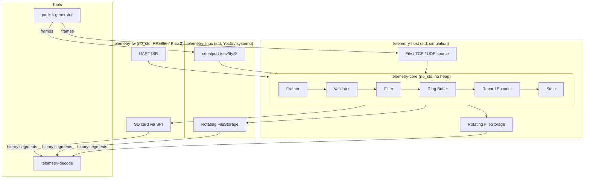

# rust-telemetry-logger

A **fault-tolerant telemetry logger** written in Rust — one portable core, three deployment targets.

[](https://github.com/Sid180603/rust-telemetry-logger/actions/workflows/ci.yml)
[](./LICENSE-MIT)

---

## Problem Statement

Embedded systems in industrial, automotive, and scientific instrumentation must reliably
log structured telemetry from sensors and ECUs, even under:

- bursty or corrupt input streams,
- power-loss during writes,
- constrained RAM (no heap, fixed buffers only), and
- intermittent storage hardware.

This project is a production-quality reference implementation of such a system in Rust.

---

## Why Rust

| Property | How Rust delivers it |
|---|---|
| **`no_std` bare-metal** | Core logic compiles to `no_std`; no OS or allocator required |
| **Memory safety** | Ownership eliminates buffer overruns and use-after-free at compile time |
| **No data races** | `Send`/`Sync` bounds prevent accidental aliasing across ISR / task boundaries |
| **Portable HAL** | `embedded-hal` v1.0 traits decouple logic from any specific MCU |
| **Async concurrency** | Embassy tasks + channels replace RTOS and manual ISR plumbing |

---

## Architecture: One Core, Three Backends



The `telemetry-core` crate is **identical** across all three targets — same source,
same binary logic.  The only difference is which `PacketSource`, `Storage`, and `Clock`
implementation is wired in at the backend layer.

---

## Workspace Layout

```
rust-telemetry-logger/
  crates/
    telemetry-core/    # #![no_std] #![forbid(unsafe_code)] — the heart
    telemetry-std/     # std Clock + rotating FileStorage (shared by host + linux)
    telemetry-host/    # host simulation binary
    telemetry-linux/   # embedded Linux daemon (Yocto / systemd target)
    telemetry-fw/      # RP2350 / Pico 2 firmware (blocking v1 → async v2)
  tools/
    packet-generator/  # emit valid/invalid/bursty test frames
    telemetry-decode/  # decode binary log segments → table / JSON / NDJSON
  yocto/
    meta-telemetry/    # BitBake layer: recipe + systemd service + image append
  docs/                # architecture, protocol, memory-model, failure-modes, yocto
  .github/workflows/   # CI: fmt + clippy + tests + no_std build + cross build
```

---

## Quick Start (host simulation — no hardware needed)

The full loop — fake sensor → pipeline → log files → viewer — runs entirely on
your laptop with no embedded hardware.

```bash
# 1. Build all host crates
cargo build

# 2. Generate 200 test frames (mix of valid + bad-CRC + seq-gap), save to a file
cargo run -p packet-generator -- \
  --count 200 --seed 42 \
  --corrupt bad-crc,seq-gap --corrupt-rate 0.15 \
  --out file:frames.bin

# 3. Run the pipeline: ingest frames → rotating .bin segments in logs/
cargo run -p telemetry-host -- \
  --in file:frames.bin \
  --out-dir logs \
  --segment-size 8192

# 4a. View records as a human-readable table
cargo run -p telemetry-decode -- logs/seg-00001.bin --format table

# 4b. View as NDJSON (pipe to jq for filtering)
cargo run -p telemetry-decode -- --in-dir logs --format ndjson | jq .

# 4c. Show only errors and above, with a stats summary
cargo run -p telemetry-decode -- --in-dir logs --min-severity 3 --stats

# 5. Run all tests
cargo test --workspace --exclude telemetry-fw
```

**One-liner demo** (PowerShell):
```powershell
cargo run -p packet-generator -- --count 50 --out file:demo.bin; `
cargo run -p telemetry-host   -- --in file:demo.bin --out-dir demo-logs --stats-interval 0; `
cargo run -p telemetry-decode -- --in-dir demo-logs --format table
```

> The pipeline stats line (stderr) shows accepted / dropped / crc\_fail / seq\_gap counts,
> proving the validation layer handled the injected corruption gracefully.

---

## Build Targets

| Target | Command | Notes |
|---|---|---|
| Host (Windows / Linux) | `cargo build` | Uses `default-members`, excludes firmware |
| no_std verify | `cargo build -p telemetry-core --target thumbv8m.main-none-eabihf` | Proves no_std |
| Firmware (debug) | `cargo fw` | Requires `thumbv8m.main-none-eabihf` target |
| Firmware (flash) | `cargo fw-flash` | Requires probe-rs + debug probe |
| Linux cross (aarch64) | `cross build -p telemetry-linux --target aarch64-unknown-linux-gnu` | For Yocto / Pi 4 |

---

## Test Strategy

| Layer | Method |
|---|---|
| `telemetry-core` unit | `cargo test -p telemetry-core` — runs on host |
| `telemetry-core` property | `proptest` framer + record round-trip invariants |
| `telemetry-core` fuzz | `cargo fuzz run framer` (WSL nightly) |
| Integration | `assert_cmd` + `assert_fs`: generator → host → decode |
| Linux daemon | `socat` virtual serial pair + `packet-generator` |
| Firmware | `defmt-test` on-target; `qemu-exit` for no_std logic tests |

---

## Protocol Summary

Frames are COBS-encoded (0x00 delimiter) on the wire.  Stored records use
`postcard` enum versioning + CRC-32/ISO-HDLC.  See [docs/protocol.md](docs/protocol.md).

---

## Safety Story

`telemetry-core` uses `#![forbid(unsafe_code)]`.  Any `unsafe` is isolated to
hardware abstraction layers in `telemetry-fw` (e.g. DMA buffer access via
`embedded-hal`-backed drivers).  See [docs/memory-model.md](docs/memory-model.md)
for an inventory of unsafe blocks and their invariants.

---

## Roadmap

### Implemented
- [ ] Phase 0 — Foundations (workspace, CI, docs skeleton) ← **in progress**
- [ ] Phase 1 — `telemetry-core` logic + tests
- [ ] Phase 2 — Host simulation + `telemetry-decode` tool
- [ ] Phase 3 — Embedded Linux daemon
- [ ] Phase 4 — Yocto integration (QEMU → Raspberry Pi 4/5)
- [ ] Phase 5 — RP2350 firmware v1 (blocking)
- [ ] Phase 6 — RP2350 firmware v2 (async / Embassy)
- [ ] Phase 7 — Expert polish (docs, CI matrix, feature flags)

### Planned targets
- NXP i.MX8 Yocto image (industrial-grade SoC)
- MQTT telemetry egress on Linux backend (like [QuartiQ Stabilizer](https://github.com/quartiq/stabilizer))
- Runtime config tree via [miniconf](https://github.com/quartiq/miniconf)
- Self-hosted CI runner building full Yocto image on release tags
- A/B bootloader / OTA update

---

## License

Licensed under either of [MIT](LICENSE-MIT) or [Apache-2.0](LICENSE-APACHE) at your option.
